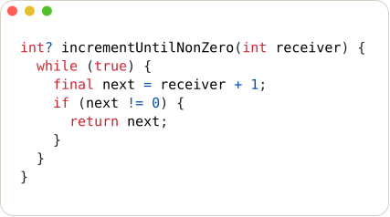
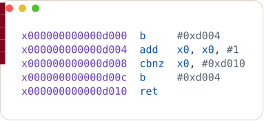
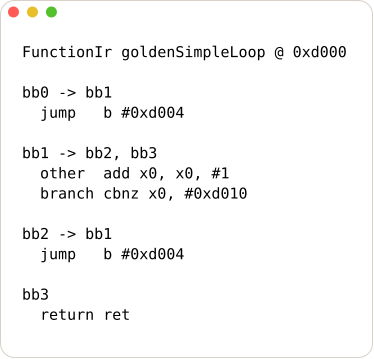
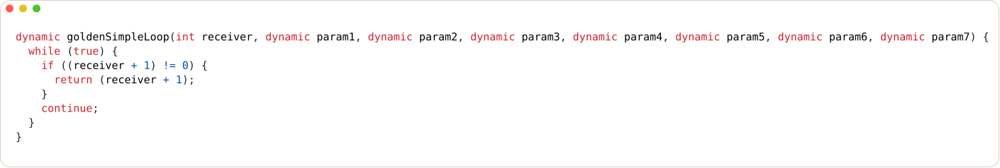

<p align="center">
  
</p>

# flutterdec

[](https://github.com/caverav/flutterdec/actions/workflows/ci.yml)
[](https://github.com/caverav/flutterdec/actions/workflows/release.yml)

`flutterdec` is a static Flutter AOT decompiler research tool for Android ARM64 binaries.

It takes an APK (or `libapp.so`) and emits readable pseudo-Dart plus optional IR/ASM artifacts.

<p align="center">
  <strong>APK / libapp.so</strong> -> <strong>ARM64 decode</strong> -> <strong>Function IR</strong> -> <strong>pseudo-Dart + reports</strong>
</p>

## See The Pipeline

The example below is built from the checked-in `structured_loop_emit` golden fixture, so each stage is versioned with the repository.
The first panel shows equivalent source intent for the control-flow shape; the remaining panels show the same function as `flutterdec` sees it while moving from disassembly to IR to recovered pseudocode.

<table>
  <tr>
    <td width="50%" valign="top">
      <strong>Equivalent Source Intent</strong><br>
      <sub>What a human would write for the same behavior.</sub><br><br>
      
    </td>
    <td width="50%" valign="top">
      <strong>ARM64 Fragment</strong><br>
      <sub>The branch structure still visible in machine code.</sub><br><br>
      
    </td>
  </tr>
  <tr>
    <td width="50%" valign="top">
      <strong>Function IR</strong><br>
      <sub>Basic blocks and edges before final structuring.</sub><br><br>
      
    </td>
    <td width="50%" valign="top">
      <strong>Recovered Pseudocode</strong><br>
      <sub>The readability-oriented output written to <code>pseudocode/*.dartpseudo</code>.</sub><br><br>
      
    </td>
  </tr>
</table>

For a real APK, this is the same side-by-side comparison you do when validating a result: inspect `asm/*.s`, confirm the CFG shape in `ir/*.json`, then decide whether `pseudocode/*.dartpseudo` preserved the behavior cleanly enough for reversing work.

## What You Inspect

| Need | Artifact | Why it matters |
| --- | --- | --- |
| Recover readable logic | `pseudocode/*.dartpseudo` | Best first-pass view of branches, loops, returns, and named callsites |
| Validate decompiler decisions | `asm/*.s` and `ir/*.json` | Lets you confirm control-flow shape when pseudocode gets suspicious |
| Trace Flutter startup | `report.json.android_startup` | Surfaces manifest anchors, embedder stages, and recovered `DartEntrypoint` evidence |
| Audit analysis quality | `quality.json` and `report.json` | Shows coverage, compatibility, target selection, and symbol-ingestion diagnostics |

## North Star

Recover readable behavior from Flutter AOT ARM64 binaries with enough semantic structure that reverse engineering decisions can be made from pseudocode and reports.

### Primary Goals

- robust semantic extraction from snapshots and metadata (libraries, classes, functions, selectors, pool semantics)
- stable reverse-engineering-oriented pseudocode output for Android ARM64 release builds
- version-aware adapter behavior that can be updated without rewriting core/decompiler logic

### Non-Goals (Current Scope)

- perfect source reconstruction of original Dart code
- broad multi-arch support in the same maturity level (x86, iOS, JIT modes)
- dynamic runtime emulation as the default analysis path

## Who This Is For

- reverse engineers and security researchers
- Flutter internals researchers
- developers comparing stripped/unstripped engine builds

## Quick Start

1. Run with `nix run` (recommended, no install):

```bash
nix run github:caverav/flutterdec -- --help
nix run github:caverav/flutterdec -- info ./sample.apk --json
```

From this repository checkout:

```bash
nix run . -- --help
```

2. Install release binary (`v0.1.0-alpha.2`):

Linux x64:

```bash
curl -fLO https://github.com/caverav/flutterdec/releases/download/v0.1.0-alpha.2/flutterdec-v0.1.0-alpha.2-Linux-X64.tar.gz
tar -xzf flutterdec-v0.1.0-alpha.2-Linux-X64.tar.gz
sudo install -m 0755 flutterdec /usr/local/bin/flutterdec
flutterdec --help
```

macOS arm64:

```bash
curl -fLO https://github.com/caverav/flutterdec/releases/download/v0.1.0-alpha.2/flutterdec-v0.1.0-alpha.2-macOS-ARM64.tar.gz
tar -xzf flutterdec-v0.1.0-alpha.2-macOS-ARM64.tar.gz
sudo install -m 0755 flutterdec /usr/local/bin/flutterdec
flutterdec --help
```

Other platforms and future tags:

[Releases page](https://github.com/caverav/flutterdec/releases)

3. Other options:

Install into user Cargo bin (requires Nix with flakes enabled):

```bash
nix develop -c cargo install --path crates/flutterdec-cli
~/.cargo/bin/flutterdec --help
```

Run from source without installing:

```bash
nix develop -c cargo run -p flutterdec-cli -- info ./sample.apk --json
```

Build local release binary:

```bash
nix develop -c cargo build -p flutterdec-cli --release
./target/release/flutterdec --help
```

## Typical Workflow

1. Inspect target:

```bash
flutterdec info ./sample.apk --json
```

`info` now includes detected app package candidates (`app_package_counts_top`) when adapter metadata is available.
For APK inputs it also reports Android startup summary fields: `android_startup_present`, `android_startup_confidence`, `android_startup_entrypoint_count`, and `android_startup_flutter_activity_count`.

2. Install adapter for the detected Dart hash:

```bash
flutterdec adapter install --dart-hash <HASH>
```

3. Decompile:

```bash
flutterdec decompile ./sample.apk -o ./out
```

By default, `decompile` focuses app reversing (`--function-scope app-unknown`) and excludes known Flutter/Dart framework internals.

To include all functions (app + Flutter + Dart/runtime):

```bash
flutterdec decompile ./sample.apk -o ./out --function-scope all
```

To focus only specific Dart packages (repeatable):

```bash
flutterdec decompile ./sample.apk -o ./out \
  --function-scope app-unknown \
  --app-package my_app
```

If package names are unknown, inspect `report.json` at `function_scope.app_package_counts_top`.
When `--app-package` is not provided, capped prioritization also applies manifest-derived package hints (`function_scope.priority_package_hints`) to favor app-owned code (including normalized variants like `localsend_app` and `localsend` when applicable).

To target a single function for developer-focused decompile/disassembly:

```bash
flutterdec decompile ./sample.apk -o ./out \
  --target va:0x613468 \
  --emit-asm
```

`--target` accepts `id:<N>`, `va:0x<ADDR>`, `0x<ADDR>`, or `<N>` (auto id/address match).
If `<N>` is ambiguous, `flutterdec` asks for explicit `id:` or `va:`. Selection details are emitted in `report.json.target_selection`.

4. Optional: improve call names with stripped/unstripped engine pair:

```bash
flutterdec map-symbols \
  --stripped ./libflutter.stripped.so \
  --unstripped ./libflutter.unstripped.so \
  -o ./out/symbol-map \
  --register-local-cache

flutterdec decompile ./sample.apk -o ./out \
  --extra-symbol-elf ./libflutter.unstripped.so
```

If the cached engine build id matches the APK’s embedded `libflutter.so`, `decompile` auto-loads the cached `symbol_target_summary.json` and reports it under `report.json.engine_symbol_ingestion`.

5. Optional: compare two builds by recovered function signatures:

```bash
flutterdec diff --old ./old.apk --new ./new.apk -o ./out-diff --json
```

`diff_report.json` includes added/removed/common function counts plus `added_packages_top` and `removed_packages_top` summaries.

6. Optional: emit import scripts for RE tools:

```bash
flutterdec decompile ./sample.apk -o ./out \
  --emit-ghidra-script \
  --emit-ida-script
```

## Analysis Profiles

`decompile` exposes analysis-engine profiles so you can trade detail for speed.

Default profile:

- `balanced` (recommended)

Available profiles:

- `balanced`: full semantic naming/hints/reporting
- `light`: lower-overhead analysis for faster large-scale runs

Example:

```bash
flutterdec decompile ./sample.apk -o ./out --analysis-profile light
```

Adapter backend selection:

- `--adapter-backend auto` (default): try Blutter backend if configured, otherwise fallback to internal adapter
- `--adapter-backend internal`: force internal snapshot-string adapter
- `--adapter-backend blutter`: require Blutter backend (fail if unavailable)
- `--require-snapshot-hash-match`: fail early when adapter-reported snapshot hash does not match loader snapshot hash

Blutter backend environment knobs:

- `FLUTTERDEC_BLUTTER_CMD`: full command to launch Blutter (for example `python3 /path/to/blutter.py`)
- `FLUTTERDEC_BLUTTER_PY`: path to `blutter.py` (uses current Python interpreter)

Nix integration:

- `nix develop` now provides `flutterdec-blutter` and auto-exports `FLUTTERDEC_BLUTTER_CMD` to that wrapper.
- You can also run the wrapper directly via `nix run .#blutter-bridge -- --help`.

You can explicitly enable/disable individual engine toggles:

- `--with-canonical-model-symbols` / `--no-canonical-model-symbols`
- `--with-pool-value-hints` / `--no-pool-value-hints`
- `--with-pool-semantic-hints` / `--no-pool-semantic-hints`
- `--with-semantic-reporting` / `--no-semantic-reporting`
- `--with-bootflow-category-seeds` / `--no-bootflow-category-seeds`
- `--with-apk-startup-analysis` / `--no-apk-startup-analysis`

## Output

Main outputs under `-o <OUT_DIR>`:

- `pseudocode/*.dartpseudo`
- `quality.json`
- `report.json`
- `diff_report.json` (if `flutterdec diff`)
- `asm/*.s` (if `--emit-asm`)
- opcode-prefixed asm lines (if `--emit-asm --emit-asm-opcodes`)
- `ghidra_apply_symbols.py` (if `--emit-ghidra-script`; applies symbol names and pool-load comments)
- `ida_apply_symbols.py` (if `--emit-ida-script`; applies symbol names and pool-load comments in IDA)
- `ir/*.json` (if `--emit-ir`)

`report.json` also includes:

- `compatibility` for schema/hash/manifest alignment diagnostics
- `android_manifest` for manifest-derived launcher/deeplink/activity signals
- `android_startup` for APK bytecode startup evidence such as embedding calls, JNI bootstrap stages, and recovered `DartEntrypoint` callsites when present
- recovered `android_startup.dart_entrypoints` entries can now carry `function_name`, `library_uri`, and `app_bundle_path` when those values are directly recoverable from APK bytecode or through simple app-helper return propagation
- `android_startup.bootstrap_chain` summarizes observed Android embedder startup stages per source method, including app-vs-framework ownership, ordered stages, completeness, and missing steps
- `engine_symbol_ingestion` for auto-loaded local engine symbol cache matches keyed by `libflutter.so` build id
- `bootflow_discovery` entries tagged by `source` (`adapter`, `manifest`, `apk_startup`); APK-startup-backed entries may appear with `target_va: null` when the startup signal is real but the Dart function is not yet mapped

## Documentation

- User guide: [docs/user-guide.md](docs/user-guide.md)
- CLI reference: [docs/cli-reference.md](docs/cli-reference.md)
- Development guide: [docs/development.md](docs/development.md)
- Architecture: [docs/architecture.md](docs/architecture.md)
- Internals walkthrough: [docs/how-it-works.md](docs/how-it-works.md)
- Research decisions: [docs/research-decisions.md](docs/research-decisions.md)
- Contributing: [CONTRIBUTING.md](CONTRIBUTING.md)
- Context and project history: [context.md](context.md)

## Issue Types

- Bug report: [new bug issue](https://github.com/caverav/flutterdec/issues/new?template=bug_report.md)
- Feature request: [new feature issue](https://github.com/caverav/flutterdec/issues/new?template=feature_request.md)
- Research finding: [new research issue](https://github.com/caverav/flutterdec/issues/new?template=research_finding.md)
