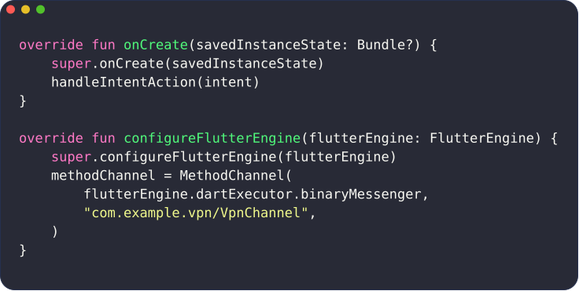
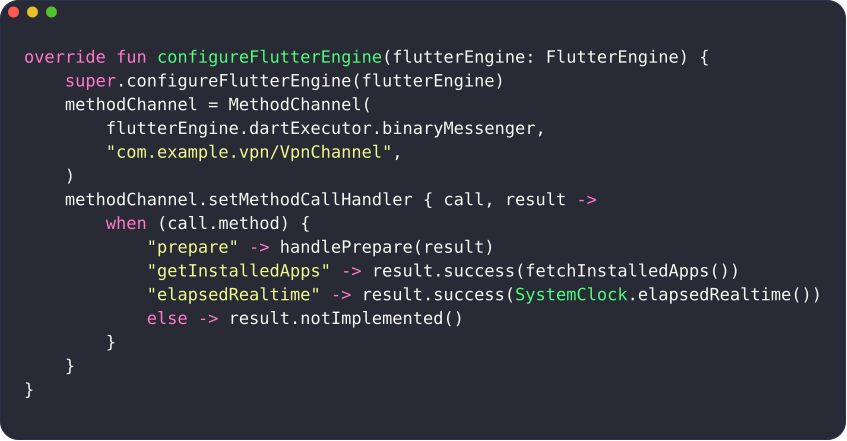
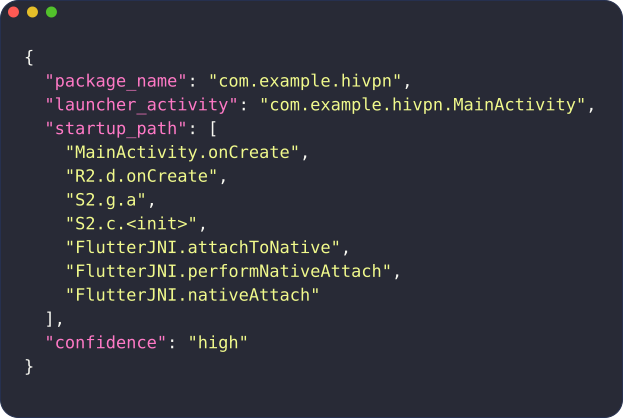
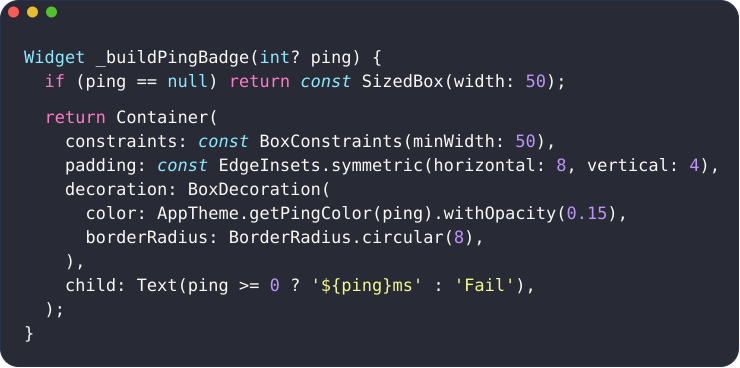
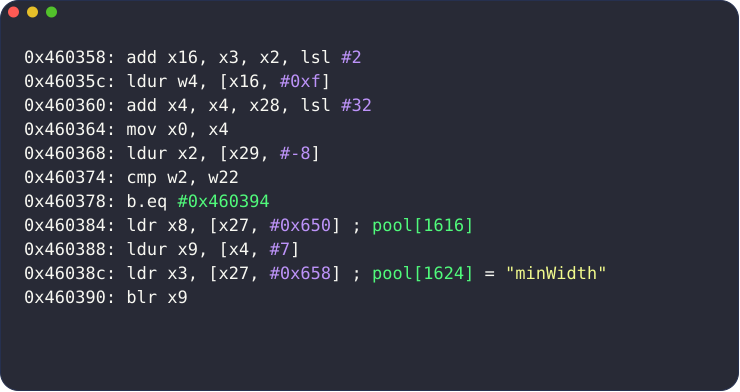
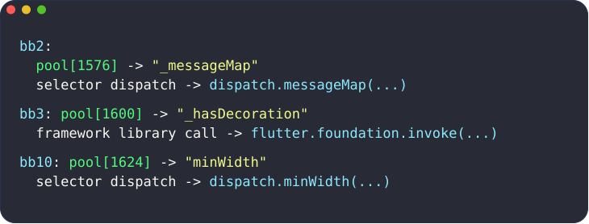
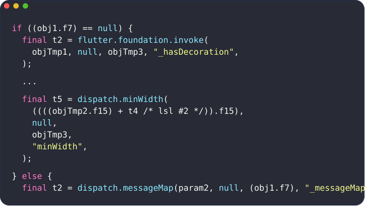
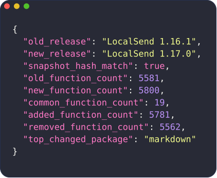

<p align="center">
  
</p>

# flutterdec

[](https://github.com/caverav/flutterdec/actions/workflows/ci.yml)
[](https://github.com/caverav/flutterdec/actions/workflows/release.yml)

`flutterdec` is a static Flutter AOT decompiler research tool for Android ARM64 binaries.

It takes an APK or `libapp.so` and emits readable pseudo-Dart plus optional IR, asm, diff, startup, and symbol-reporting artifacts.

## What It Is For

`flutterdec` is meant for people reversing Flutter apps who want a practical first pass that is more readable than raw disassembly, while still being easy to verify against lower-level artifacts.

If you are new to the project, the fastest way to think about it is:

- `info` tells you what the target looks like
- `decompile` gives you pseudocode plus reports
- `diff` compares two builds
- `map-symbols` improves naming when you have matched engine binaries

## Supported Scope

- Android Flutter AOT
- ARM64
- static analysis
- input as APK or `libapp.so`

## Get Started

If you just want to try the tool, start with one of these paths:

- no install: `nix run`
- persistent Nix install: `nix profile install`
- persistent install: release binaries

### Run Without Installing

Run directly from GitHub:

```bash
nix run github:caverav/flutterdec -- --help
nix run github:caverav/flutterdec -- info ./sample.apk --json
nix run github:caverav/flutterdec -- decompile ./sample.apk -o ./out
```

Run from a local checkout:

```bash
nix run . -- --help
nix run . -- info ./sample.apk --json
nix run . -- decompile ./sample.apk -o ./out
```

### Install Persistently With Nix

Install from GitHub:

```bash
nix profile install github:caverav/flutterdec
flutterdec --help
```

Install from a local checkout:

```bash
nix profile install .
flutterdec --help
```

Update later:

```bash
nix profile upgrade flutterdec
```

### Install A Release Binary

Current prerelease: [`v0.1.0-alpha.4`](https://github.com/caverav/flutterdec/releases/tag/v0.1.0-alpha.4)

Linux x64:

```bash
curl -fLO https://github.com/caverav/flutterdec/releases/download/v0.1.0-alpha.4/flutterdec-v0.1.0-alpha.4-Linux-X64.tar.gz
tar -xzf flutterdec-v0.1.0-alpha.4-Linux-X64.tar.gz
sudo install -m 0755 flutterdec /usr/local/bin/flutterdec
flutterdec --help
```

macOS arm64:

```bash
curl -fLO https://github.com/caverav/flutterdec/releases/download/v0.1.0-alpha.4/flutterdec-v0.1.0-alpha.4-macOS-ARM64.tar.gz
tar -xzf flutterdec-v0.1.0-alpha.4-macOS-ARM64.tar.gz
sudo install -m 0755 flutterdec /usr/local/bin/flutterdec
flutterdec --help
```

Other platforms and future tags:

[Releases page](https://github.com/caverav/flutterdec/releases)

### Other Ways To Run It

Install into the user Cargo bin:

```bash
nix develop -c cargo install --path crates/flutterdec-cli
~/.cargo/bin/flutterdec --help
```

Run from source without installing:

```bash
nix develop -c cargo run -p flutterdec-cli -- --help
nix develop -c cargo run -p flutterdec-cli -- info ./sample.apk --json
nix develop -c cargo run -p flutterdec-cli -- decompile ./sample.apk -o ./out
```

Build a local release binary:

```bash
nix develop -c cargo build -p flutterdec-cli --release
./target/release/flutterdec --help
```

## First Use

If this is your first run, this is the shortest useful path.

1. Inspect the target:

```bash
flutterdec info ./sample.apk --json
```

`info` resolves the Dart SDK version straight from the snapshot hash, with no adapter
installed and no disassembly:

- `dart_version` (for example `3.9.2`)
- `dart_tag_style` (`CID_INT32`, `CID_SHIFT1`, or `OBJECT_HEADER`)

Both are `null` for snapshot hashes not in the bundled table (`data/dart-profiles.json`).

For APK inputs, `info` reports Android startup summary fields such as:

- `android_startup_present`
- `android_startup_confidence`
- `android_startup_entrypoint_count`
- `android_startup_flutter_activity_count`

If adapter metadata is available, `info` also reports package and compatibility signals such as:

- `app_package_counts_top`
- `adapter_kind`
- `adapter_snapshot_hash_match`
- `compatibility_warnings`

2. Install the adapter for the detected Dart hash:

```bash
flutterdec adapter install --dart-hash <HASH>
```

3. Decompile:

```bash
flutterdec decompile ./sample.apk -o ./out
```

**Expect a non-zero exit on a real app, and expect your artifacts anyway.** The strict quality gate is on by
default with `--max-placeholder-ifs 0`, and every real Flutter app has placeholder ifs. So the command above
prints `reasons: placeholder if-count exceeded threshold`, exits `1`, and **still writes every artifact
listed in step 4**. Nothing is missing - the gate is reporting a quality measurement, not a failure to
decompile. Measured on LocalSend 1.17: 501 at the default scope, 5,800 pseudocode files written, exit 1.

Read your own number rather than guessing one. It is `placeholder_ifs` in `out/quality.json`, and it grows
with scope - the same app reports 1,178 under `--function-scope all --split-records`:

```bash
flutterdec decompile ./sample.apk -o ./out            # exits 1, writes everything
python3 -c "import json;print(json.load(open('out/quality.json'))['placeholder_ifs'])"
flutterdec decompile ./sample.apk -o ./out --max-placeholder-ifs <that number>
```

Setting the threshold from the measurement is the point: a huge round number silences the gate permanently,
whereas a real one still fails when the count **rises**, which is the only thing it is useful for. Keep the
strict default in CI. See [`docs/cli-reference.md`](docs/cli-reference.md) for the other gate flags.

4. Open the main outputs first:

- `out/pseudocode/*.dartpseudo`
- `out/report.json`
- `out/quality.json`

That is enough to start working on most APKs.

## Common Commands

Inspect target metadata:

```bash
flutterdec info ./sample.apk --json
```

Install and list adapters:

```bash
flutterdec adapter install --dart-hash <HASH>
flutterdec adapter list
```

Decompile with the default app-focused scope:

```bash
flutterdec decompile ./sample.apk -o ./out
```

Emit asm and IR too:

```bash
flutterdec decompile ./sample.apk -o ./out --emit-asm --emit-ir
```

Compare two builds:

```bash
flutterdec diff --old ./old.apk --new ./new.apk -o ./out-diff --json
```

Generate Ghidra and IDA import scripts:

```bash
flutterdec decompile ./sample.apk -o ./out \
  --emit-ghidra-script \
  --emit-ida-script
```

## How To Use It

### Choose Function Scope

By default, `decompile` focuses app reversing with `--function-scope app-unknown` and excludes known Flutter/Dart framework internals.

Available scopes:

- `app-unknown` (default): app (`package:*`) plus unknown ownership functions
- `app`: only app (`package:*`) functions
- `all`: app plus Flutter, Dart runtime, and framework internals

Include everything:

```bash
flutterdec decompile ./sample.apk -o ./out --function-scope all
```

Focus only specific Dart packages (repeatable):

```bash
flutterdec decompile ./sample.apk -o ./out \
  --function-scope app-unknown \
  --app-package my_app
```

If package names are unknown, inspect `report.json` under `function_scope.app_package_counts_top`.
When `--app-package` is not provided, capped prioritization also uses manifest-derived package hints under `function_scope.priority_package_hints` to favor app-owned code.

### Decompile One Specific Function

Target a specific function by id:

```bash
flutterdec decompile ./sample.apk -o ./out \
  --target id:42 \
  --emit-asm
```

Target by entry address:

```bash
flutterdec decompile ./sample.apk -o ./out \
  --target va:0x613468 \
  --emit-asm
```

`--target` accepts:

- `id:<N>`
- `va:0x<ADDR>`
- `0x<ADDR>`
- `<N>`

If `<N>` is ambiguous, `flutterdec` requires explicit `id:` or `va:`. Selection details are emitted in `report.json.target_selection`.

### Improve Naming With Engine Symbols

If you have a stripped/unstripped `libflutter.so` pair, generate a symbol map:

```bash
flutterdec map-symbols \
  --stripped ./libflutter.stripped.so \
  --unstripped ./libflutter.unstripped.so \
  -o ./out/symbol-map \
  --register-local-cache
```

Then use that in later decompile runs:

```bash
flutterdec decompile ./sample.apk -o ./out \
  --extra-symbol-elf ./libflutter.unstripped.so
```

If the cached engine build id matches the APK's embedded `libflutter.so`, `decompile` auto-loads the cached `symbol_target_summary.json` and reports it under `report.json.engine_symbol_ingestion`.

### Compare Two Builds

```bash
flutterdec diff --old ./old.apk --new ./new.apk -o ./out-diff --json
```

`diff_report.json` includes added, removed, and common function summaries plus `added_packages_top` and `removed_packages_top` churn summaries.

## What To Look At

| If you want to... | Start with... | Why |
| --- | --- | --- |
| Read recovered logic | `pseudocode/*.dartpseudo` | Best first pass for branches, loops, returns, and named callsites |
| Validate the decompiler | `asm/*.s` and `ir/*.json` | Lets you confirm control flow and pool-backed calls |
| Understand startup | `report.json.android_startup` | Shows manifest anchors, startup stages, and `DartEntrypoint` evidence |
| Check analysis health | `quality.json` and `report.json` | Shows coverage, compatibility, target selection, and symbol-ingestion diagnostics |
| Review version-to-version changes | `diff_report.json` | Shows recovered function churn and package-level change summaries |

## Analysis Profiles And Engine Options

`decompile` exposes analysis-engine profiles so you can trade detail for speed.

Default profile:

- `balanced` (recommended)

Available profiles:

- `balanced`: full semantic naming, hints, and reporting
- `light`: lower-overhead analysis for faster large-scale runs

Example:

```bash
flutterdec decompile ./sample.apk -o ./out --analysis-profile light
```

Adapter backend selection:

- `--adapter-backend auto` (default): try r2flutter, then Blutter, then fall back to the internal adapter
- `--adapter-backend internal`: force the internal adapter only
- `--adapter-backend blutter`: require the Blutter backend and fail if unavailable
- `--adapter-backend r2-flutter`: require the r2flutter backend and fail if unavailable
- `--require-snapshot-hash-match`: fail when the adapter-reported snapshot hash does not match the loader snapshot hash

What the backends actually recover:

| Backend | Function names | Classes | ObjectPool |
| --- | --- | --- | --- |
| `internal` | none (`sub_<addr>` placeholders) | none | carved strings, no real index space |
| `blutter` | exact, from Blutter dumps | yes | Blutter `pp.txt` entries |
| `r2flutter` | exact, from the AOT instruction table | yes, with fields and methods | real slots, resolvable from `x27` displacements |

Only backends that recover the real `ObjectPool` layout report `pool_geometry`. Without
it `flutterdec` leaves pool references unresolved rather than attaching a value from an
unrelated index space, and says so in `report.json.pool_metadata.hints_suppressed_reason`.

r2flutter backend environment knobs:

- `FLUTTERDEC_R2FLUTTER_BIN`: path to the `r2flutter` binary
- `FLUTTERDEC_R2FLUTTER_CMD`: full command to launch it, when a wrapper is needed
- `FLUTTERDEC_R2FLUTTER_TIMEOUT`: per-invocation timeout in seconds (default 900)
- otherwise `r2flutter` is taken from `PATH`

`r2flutter` is an external MIT tool ([radareorg/r2flutter](https://github.com/radareorg/r2flutter))
that parses Dart AOT snapshots directly. It needs radare2 available at build time.

Blutter backend environment knobs:

- `FLUTTERDEC_BLUTTER_CMD`: full command to launch Blutter, for example `python3 /path/to/blutter.py`
- `FLUTTERDEC_BLUTTER_PY`: path to `blutter.py` when you want the current Python interpreter to run it

Nix integration:

- `nix develop` provides `flutterdec-blutter` and auto-exports `FLUTTERDEC_BLUTTER_CMD` to that wrapper
- you can also run the wrapper directly via `nix run .#blutter-bridge -- --help`

Per-feature engine toggles:

- `--with-canonical-model-symbols` / `--no-canonical-model-symbols`
- `--with-pool-value-hints` / `--no-pool-value-hints`
- `--with-pool-semantic-hints` / `--no-pool-semantic-hints`
- `--with-semantic-reporting` / `--no-semantic-reporting`
- `--with-bootflow-category-seeds` / `--no-bootflow-category-seeds`
- `--with-apk-startup-analysis` / `--no-apk-startup-analysis`

## Output Layout

Main outputs under `-o <OUT_DIR>`:

- `pseudocode/*.dartpseudo`
- `quality.json`
- `report.json`
- `diff_report.json` (if `flutterdec diff`)
- `asm/*.s` (if `--emit-asm`)
- opcode-prefixed asm lines (if `--emit-asm --emit-asm-opcodes`)
- `ghidra_apply_symbols.py` (if `--emit-ghidra-script`)
- `ida_apply_symbols.py` (if `--emit-ida-script`)
- `ir/*.json` (if `--emit-ir`)

`report.json` also includes:

- `compatibility` for schema, hash, and manifest alignment diagnostics
- `android_manifest` for manifest-derived launcher, deeplink, and activity signals
- `android_startup` for APK bytecode startup evidence such as embedding calls, JNI bootstrap stages, and recovered `DartEntrypoint` callsites when present
- `android_startup.dart_entrypoints` entries can carry `function_name`, `library_uri`, and `app_bundle_path` when those values are directly recoverable from APK bytecode or simple helper return propagation
- `android_startup.bootstrap_chain` summarizes observed Android embedder startup stages per source method, including ownership, stage ordering, completeness, and missing steps
- `engine_symbol_ingestion` for auto-loaded local engine symbol cache matches keyed by `libflutter.so` build id
- `bootflow_discovery` entries tagged by `source` (`adapter`, `manifest`, `apk_startup`)

For the complete public emission-counter schema, units, block-ledger semantics,
and record-split rejection diagnostics, see
[`docs/cli-reference.md`](docs/cli-reference.md#emission-diagnostics-in-qualityjson).

## See The Pipeline

The goal of these examples is simple: show original public source first, then show what `flutterdec` recovers from the shipped APK.

<p align="center"><strong>Original 1: Android Startup Surface</strong></p>

<p align="center">
  
</p>

<p align="center"><strong>Original 2: App-Side Flutter / Dart Surface</strong></p>

<p align="center">
  
</p>

**Compare 1: Startup Source -> Recovered Startup Path**

Source app: `hiVPN v1.0.0` released on October 29, 2025. `MainActivity` and the manifest launcher are public in the repository:
- Source repo: https://github.com/Mr-Dark-debug/hivpn
- Release APK: https://github.com/Mr-Dark-debug/hivpn/releases/tag/release

`Original`

The app enters Flutter from `MainActivity.onCreate`. The second source card shows the app-side Flutter bridge that exposes `MethodChannel('com.example.vpn/VpnChannel')` to Dart code.

<p align="center"><strong>Recovered 1: APK Startup Report</strong></p>

<p align="center">
  
</p>

`Recovered`

`flutterdec` parsed the APK manifest, recovered `com.example.hivpn.MainActivity` as the launcher, and correlated the startup chain from `MainActivity.onCreate` into Flutter JNI bootstrap calls such as `attachToNative` and `nativeAttach`.

**Compare 2: App Source Using Flutter APIs -> Recovered Named Selectors**

Source app: `ZedSecure v1.2.0`
- Source repo: https://github.com/CluvexStudio/ZedSecure
- Release APK: https://github.com/CluvexStudio/ZedSecure/releases/tag/v1.2.0

This is the comparison you asked for: public app source that uses Flutter APIs, then recovered APK artifacts where `flutterdec` keeps recognizable Dart and Flutter selector names instead of only anonymous control flow.

<p align="center"><strong>Original Source</strong></p>

<p align="center">
  
</p>

This source is ordinary app UI code. It builds a ping badge with `BoxConstraints(minWidth: 50)` and other Flutter widget APIs inside the shipped app.

<p align="center"><strong>Recovered 2: From The ZedSecure APK With flutterdec</strong></p>

<p align="center"><strong>Next: ARM64</strong></p>

At the machine-code layer, the APK still looks like indirect selector dispatch through pool-loaded metadata and call targets.

<p align="center">
  
</p>

<p align="center">
  <strong>Next: Function IR</strong>
</p>

<p align="center">
  
</p>

The IR stage makes the selector-bearing pool values explicit before readability passes.

<p align="center">
  <strong>Next: Pseudocode</strong>
</p>

<p align="center">
  
</p>

The important part is not the anonymous function name. The important part is that `flutterdec` surfaced readable Flutter selector names from the AOT payload, including `dispatch.minWidth(...)`, `dispatch.messageMap(...)`, and the framework-side `flutter.foundation.invoke(...)`.

This capture is from a target whose adapter recovered class and selector metadata. Selector naming is gated on that metadata: on a target where the adapter recovers only strings, the same run emits no selector names at all (measured zero on two release APKs). Function names, control flow, and expressions do not depend on it.

This gives the README both views the tool is meant to show publicly:

- Android startup recovery from the APK surface
- app-side Flutter selector recovery from the AOT payload

**What this proves**

- `flutterdec` can preserve recognizable Flutter and Dart utility selectors inside app-owned recovered code
- selector-bearing pool metadata survives from asm to IR to pseudocode
- the pipeline is inspectable at every stage: asm, IR, and pseudocode

<p align="center">
  
</p>

**Case 3: Original Release A -> Original Release B -> Recovered Diff**

Source app: `LocalSend`
- `v1.16.1` released on November 5, 2024
- `v1.17.0` released on February 20, 2025
- Releases: https://github.com/localsend/localsend/releases

`Original`

Two public release APKs from the same app line.

`Recovered`

`flutterdec diff` compared the two arm64 APKs directly and emitted added, removed, and common function summaries plus package-level change counts. This is useful when you care more about what changed between versions than about reconstructing a single function in isolation.

## North Star

Recover readable behavior from Flutter AOT ARM64 binaries with enough semantic structure that reverse engineering decisions can be made from pseudocode and reports.

### Primary Goals

- robust semantic extraction from snapshots and metadata such as libraries, classes, functions, selectors, and pool semantics
- stable reverse-engineering-oriented pseudocode for Android ARM64 release builds
- version-aware adapter behavior that can be updated without rewriting the core and decompiler logic

### Non-Goals

- perfect reconstruction of the original Dart source
- broad multi-arch support at the same maturity level such as x86, iOS, or JIT modes
- dynamic runtime emulation as the default analysis path

## Documentation

- User guide: [docs/user-guide.md](docs/user-guide.md)
- CLI reference: [docs/cli-reference.md](docs/cli-reference.md)
- Development guide: [docs/development.md](docs/development.md)
- Architecture: [docs/architecture.md](docs/architecture.md)
- Internals walkthrough: [docs/how-it-works.md](docs/how-it-works.md)
- Research decisions: [docs/research-decisions.md](docs/research-decisions.md)
- Contributing: [CONTRIBUTING.md](CONTRIBUTING.md)
- Context and project history: [context.md](context.md)

## Third-Party Credits

- `data/dart-profiles.json`: Dart snapshot hash-to-version and layout table imported from
  [radareorg/r2flutter](https://github.com/radareorg/r2flutter) (MIT). Rationale in
  [docs/research-decisions.md](docs/research-decisions.md).
- `--adapter-backend r2-flutter` drives the same project as an external tool; it is not
  bundled or linked.
- `--adapter-backend blutter` drives [worawit/blutter](https://github.com/worawit/blutter)
  as an external tool.

## Issue Types

- Bug report: [new bug issue](https://github.com/caverav/flutterdec/issues/new?template=bug_report.md)
- Feature request: [new feature issue](https://github.com/caverav/flutterdec/issues/new?template=feature_request.md)
- Research finding: [new research issue](https://github.com/caverav/flutterdec/issues/new?template=research_finding.md)
