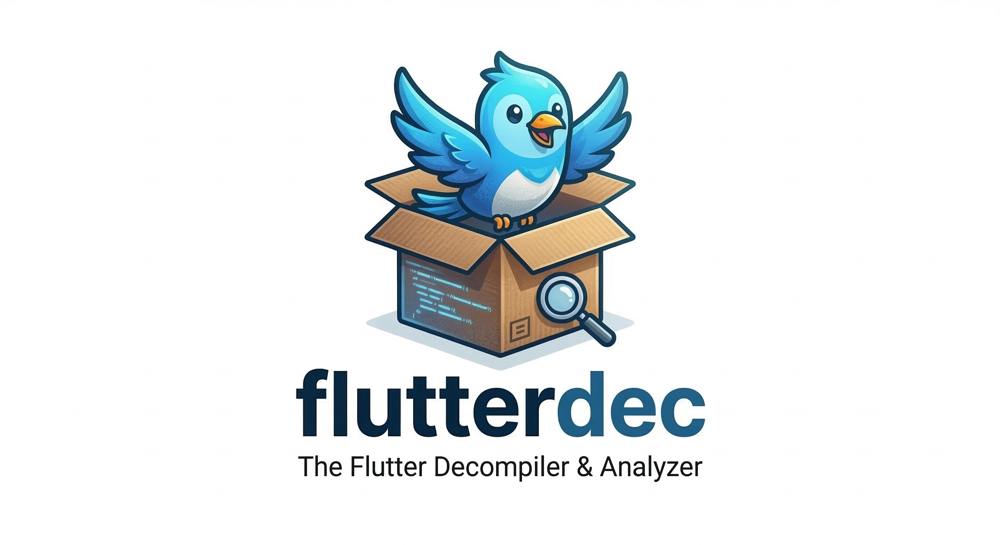
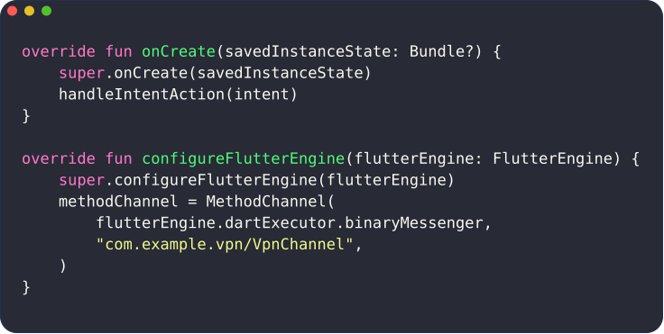
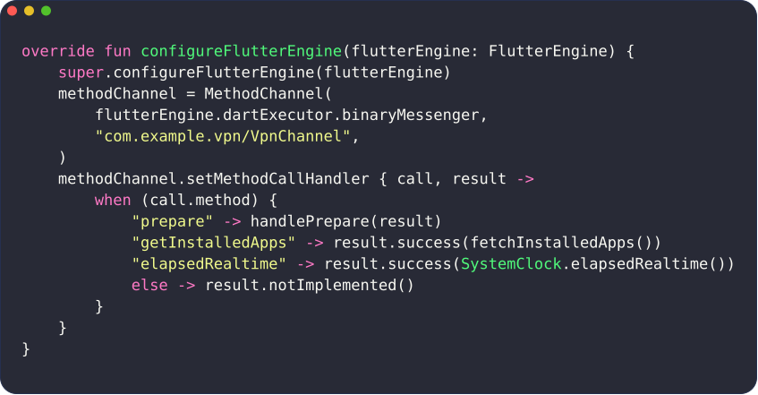
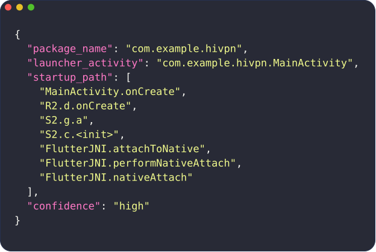
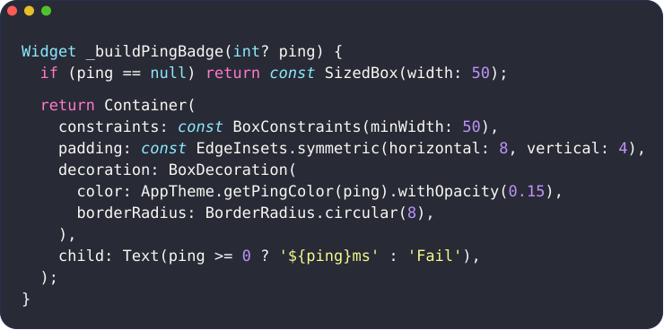
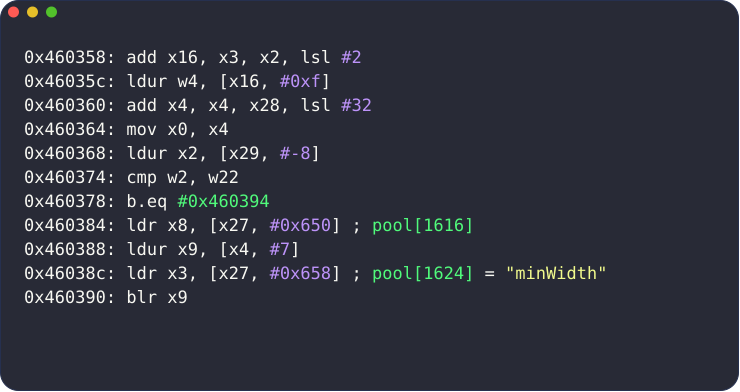
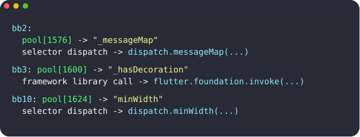
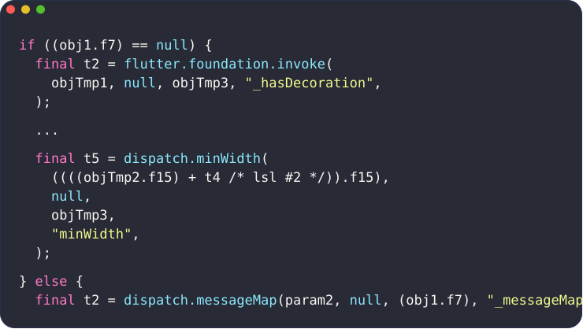
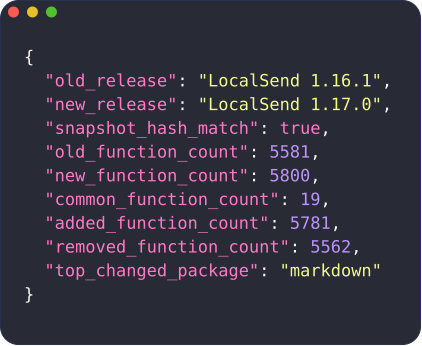

<p align="center">
  
</p>

# flutterdec

[](https://github.com/caverav/flutterdec/actions/workflows/ci.yml)
[](https://github.com/caverav/flutterdec/actions/workflows/release.yml)
[](LICENSE)

**A static decompiler for Flutter Android apps.** Point it at an APK or a `libapp.so` and it
recovers readable Dart-like pseudocode, ARM64 disassembly, an intermediate representation,
build-to-build diffs, and structured reports. Everything runs offline on your machine: the target
is never executed.

- **Input**: a Flutter app for Android built for ARM64, as an APK or a bare `libapp.so`
- **Output**: `pseudocode/*.dartpseudo` plus `report.json` and `quality.json`, with optional asm, IR, and symbol scripts
- **Use it for**: reversing an app, reviewing it for hardcoded secrets or logic flaws, or diffing two releases
- **Status**: alpha research tool; see [Project status](#project-status)

If you remember only three commands:

1. `flutterdec info` tells you what the target is.
2. `flutterdec adapter install` gives the decompiler real Dart names for that target.
3. `flutterdec decompile` produces the pseudocode and reports.

## Contents

- [What you get](#what-you-get)
- [What it is not](#what-it-is-not)
- [Requirements](#requirements)
- [Installation](#installation)
- [Quick start: your first decompile](#quick-start-your-first-decompile)
- [How it works](#how-it-works)
- [Common tasks](#common-tasks)
- [Command reference](#command-reference)
- [Output files](#output-files)
- [Troubleshooting](#troubleshooting)
- [See it in action](#see-it-in-action)
- [Project status](#project-status)
- [Documentation](#documentation)
- [Contributing](#contributing)
- [Credits and license](#credits-and-license)

## What you get

| Artifact | What it is |
| --- | --- |
| `pseudocode/*.dartpseudo` | The recovered logic: branches, loops, returns, and named callsites. Start here. |
| `report.json` and `quality.json` | What was analyzed, what was recovered, and how complete it was. |
| `asm/*.s` and `ir/*.json` | Lower-level views to verify the pseudocode (`--emit-asm --emit-ir`). |
| `ghidra_apply_symbols.py` / `ida_apply_symbols.py` | Recovered names for Ghidra or IDA (`--emit-ghidra-script`, `--emit-ida-script`). |
| `diff_report.json` | Function and package churn between two builds (`flutterdec diff`). |

## What it is not

- **Not the original source.** It reconstructs readable approximations. Names, types, and comments
  are best effort, so verify anything important against the asm and IR.
- **Not dynamic analysis.** The app is never executed. No emulator, device, or instrumentation is
  involved.
- **Not multi-platform.** Supported targets are Android Flutter AOT builds for ARM64. iOS,
  x86/x86_64, and JIT/debug builds are not supported at this maturity.
- **Not finished.** This is alpha software. Output quality varies by app and Dart/Flutter version,
  and the command set can change between prereleases.

## Requirements

| | |
| --- | --- |
| **Target** | A Flutter release build for Android ARM64 (`arm64-v8a`), as an APK or an extracted `libapp.so`. Debug/JIT builds cannot be decompiled. |
| **Input** | Any file on disk. A split APK works as long as it includes the `arm64-v8a` split, or you can use a universal APK. |
| **Host** | Linux x86_64 or macOS Apple Silicon for the prebuilt binaries. Other systems can build from source with Nix. |
| **Runtime** | Nothing beyond the CLI binary. Analysis is fully static and offline. |
| **Optional** | [Nix](https://nixos.org/download) for the zero-install path; a Rust toolchain (provided by `nix develop`) to build from source. |

## Installation

Flutter release apps ship their compiled Dart code as `lib/arm64-v8a/libapp.so` inside the APK.
`flutterdec` accepts either the APK or the extracted `libapp.so`.

### Option 1: Nix, no installation (recommended)

If you have Nix installed, one command runs the latest `main` without touching your system:

```bash
nix run github:caverav/flutterdec -- --help
```

Every example in this README works through that entry point, for example:

```bash
nix run github:caverav/flutterdec -- info ./app.apk --json
nix run github:caverav/flutterdec -- decompile ./app.apk -o ./out
```

To install it permanently instead:

```bash
nix profile install github:caverav/flutterdec
flutterdec --help
```

Update later with `nix profile upgrade flutterdec`.

### Option 2: Prebuilt release binary

Download the archive for your platform from the
[Releases page](https://github.com/caverav/flutterdec/releases): Linux x86_64 or macOS Apple
Silicon. The current prerelease is
[`v0.1.0-alpha.4`](https://github.com/caverav/flutterdec/releases/tag/v0.1.0-alpha.4).

> [!IMPORTANT]
> The standalone `v0.1.0-alpha.4` binary can inspect a target (`flutterdec info`), but it cannot
> install adapters or decompile without the packaged producer and registry from a source checkout.
> For decompilation today, use Nix (Option 1) or a source checkout (Option 3).

The archive contains a single `flutterdec` binary:

```bash
# Linux x86_64
curl -fLO https://github.com/caverav/flutterdec/releases/download/v0.1.0-alpha.4/flutterdec-v0.1.0-alpha.4-Linux-X64.tar.gz
tar -xzf flutterdec-v0.1.0-alpha.4-Linux-X64.tar.gz

# macOS Apple Silicon
curl -fLO https://github.com/caverav/flutterdec/releases/download/v0.1.0-alpha.4/flutterdec-v0.1.0-alpha.4-macOS-ARM64.tar.gz
tar -xzf flutterdec-v0.1.0-alpha.4-macOS-ARM64.tar.gz

# install the binary, then verify
sudo mkdir -p /usr/local/bin
sudo install -m 0755 flutterdec /usr/local/bin/flutterdec
flutterdec --version
```

Releases built from current `main` will ship a different layout: a prefix with `bin/flutterdec` plus
the compatibility registry, the runtime profiles, and the packaged producer under
`share/flutterdec`. On those releases the CLI resolves its data relative to its own executable, so
keep `bin` and `share` together and copy both (`sudo cp -R bin share /usr/local/`).

### Option 3: Build from a checkout

This is the route for contributors, or for running unreleased code:

```bash
git clone https://github.com/caverav/flutterdec.git
cd flutterdec
nix develop -c cargo build -p flutterdec-cli --release
./target/release/flutterdec --help
```

You can also run directly from the checkout without building, with `nix run . -- --help`. The
resulting CLI finds the `adapters/` registry and `data/` profiles in the repository, so adapters
work out of the box.

## Quick start: your first decompile

This walkthrough takes a few minutes on a normal machine. It uses `app.apk` and `./out` as example
paths; replace them with your own.

### Step 1: Inspect the target

```bash
flutterdec info ./app.apk --json
```

`info` reads the snapshot identity out of the header, with no adapter installed and no
disassembly. It tells you what you need next:

- `snapshot_hash`: the identity of the compiled Dart snapshot, and the value `adapter install` takes
- `arch` and `snapshot_features`: the target architecture and the engine build characteristics
- `registry_record_present` and the `compatibility` block: whether a known adapter covers this app,
  and if not, why (`identity_rejection`)

For APK inputs, `info` also reports manifest-derived startup signals (`android_startup_present`,
`android_startup_confidence`, `android_startup_entrypoint_count`,
`android_startup_flutter_activity_count`). When adapter metadata is available it reports app
package counts and compatibility warnings too.

The `dart_aliases`, `dart_version`, and `dart_tag_style` fields describe the matched registry
record. Aliases are provenance labels and never select a parser or profile; `dart_version` is a
display value (`unverified` when the record carries aliases, `unavailable` when it carries none);
all three are `null` when no record matches or its adapter is not installed.

No adapter is needed for this step. `--json` prints the full report; omit it for a plain-text
summary.

### Step 2: Install the adapter (recommended)

```bash
flutterdec adapter install --dart-hash <snapshot_hash from step 1>
flutterdec adapter list
```

An *adapter* is a small, hash-specific parser that knows how one Dart snapshot version lays out
libraries, classes, function names, and the object pool. Installing the adapter for your target is
what turns anonymous ARM64 into named, readable code.

- `adapter install` refuses a hash the compatibility registry has no record for, a record that does
  not serve this host, and any artifact whose bytes do not match the digest and size the record
  declares. Installs are atomic, safe to run concurrently, and report `already-installed` when the
  store is already correct.
- `adapter list` reports a verified state per record: `verified`, `missing`, `corrupt`,
  `incompatible`, or `unavailable`. It exits `2` when the store holds an install it cannot back.

If no record covers your hash, skip this step. `decompile` still runs using core recovery and says
so in `report.json`; see [Fallbacks and core recovery](#fallbacks-and-core-recovery).

### Step 3: Decompile

```bash
flutterdec decompile ./app.apk -o ./out
```

By default this focuses on app-owned code (`--function-scope app-unknown`) and excludes Flutter and
Dart framework internals.

### Step 4: Read the results

Start with these three files, in this order:

1. `out/pseudocode/*.dartpseudo` - the recovered logic
2. `out/report.json` - what was analyzed and what was recovered
3. `out/quality.json` - how complete the recovery was

### About the exit code 1 you will probably see

> [!IMPORTANT]
> **A non-zero exit is expected on a real app, and your artifacts are still written.** The strict
> quality gate is on by default (`--max-placeholder-ifs 0`), and every real Flutter app contains
> placeholder `if` statements the decompiler could not fully resolve. The command prints
> `reasons: placeholder if-count exceeded threshold`, exits `1`, and **still writes every artifact
> listed above**. Nothing is missing; the gate is reporting a quality measurement, not a failure to
> decompile.
>
> Measured on LocalSend 1.17 at the default scope: 501 placeholder ifs across 5,800 pseudocode
> files, exit 1.

Read your own number rather than guessing one. It is `placeholder_ifs` in `out/quality.json`, and
it grows with scope. Setting the threshold from that measurement is the point: a huge round number
silences the gate permanently, whereas a real one still fails when the count **rises**, which is
the only thing the gate is useful for. Keep the strict default in CI.

```bash
flutterdec decompile ./app.apk -o ./out            # exits 1, writes everything
python3 -c "import json;print(json.load(open('out/quality.json'))['placeholder_ifs'])"
flutterdec decompile ./app.apk -o ./out --max-placeholder-ifs <that number>
```

The other gates are `--max-unresolved-cf`, `--max-indirect-call-ratio`, and
`--min-disassembly-ratio`. See the [CLI reference](docs/cli-reference.md) for their defaults and for
`--split-records`.

## How it works

A Flutter release compiles Dart ahead-of-time (AOT) to ARM64 machine code and packs it, with a
snapshot header and an object pool, into `libapp.so`. Symbols and source are gone; names survive
only as metadata. `flutterdec` walks the pipeline below and records what it recovered at each
stage.

```text
APK / libapp.so
      |
      v
 [1] Loader ------> [2] Adapter ------> [3] ARM64 disassembly
                                              |
                                              v
                                  [4] IR + control-flow graph
                                              |
                                              v
                                  [5] Pseudo-Dart decompiler
                                              |
                                              v
                                  [6] quality.json + report.json
```

1. **Loader** - opens the APK or ELF and locates the snapshot blob.
2. **Adapter** - parses the version-specific snapshot format to recover libraries, classes,
   function names, and object-pool layout. Adapters are hash-verified and run as a bounded,
   one-shot job; `report.json` records which execution controls were actually established.
3. **Disassembly** - decodes ARM64 and annotates Dart ABI details such as register and pool loads.
4. **IR / CFG** - lifts instructions into an intermediate representation and rebuilds basic blocks.
5. **Decompiler** - emits structured pseudo-Dart: branches, loops, returns, and named callsites.
6. **Quality and reporting** - counts unresolved constructs and writes the reports and artifacts.

Auxiliary commands extend this core: `map-symbols` derives engine symbol names from a
stripped/unstripped pair, `engine-fingerprint` identifies an engine build from an ELF, symbol
ingestion feeds those names into `decompile`, and `diff` compares two builds at recovered-function
level.

### Adapters and backends

The backend that parses the snapshot decides how much is actually recovered:

| Backend | Function names | Classes | ObjectPool |
| --- | --- | --- | --- |
| core recovery | none at all; code ranges are unnamed | none | unavailable |
| `internal` | none at all; code ranges are unnamed | none | carved strings, ordinal index space |
| `blutter` | scraped from Blutter's rendered source, heuristic | yes | Blutter `pp.txt` entries, ordinal index space |
| `r2flutter` | exact, from the AOT instruction table | yes, library attribution unavailable | real slots, resolvable from `x27` displacements |

`--adapter-backend auto` (the default) tries r2flutter, then Blutter, then the internal path.
`--adapter-backend internal`, `blutter`, and `r2-flutter` pin the choice; a named backend either
runs or fails, and is never silently substituted.

Every recovered domain carries a capability level (`complete` / `partial` / `unavailable`) and
every fact a provenance (`exact` / `derived` / `heuristic`), so `report.json` distinguishes "not
recovered" from "recovered" rather than inventing names. A function whose name was not recovered
has no name instead of a `sub_<addr>` placeholder, and is labeled from its entry address at emit
time.

Only a backend that recovers the real `ObjectPool` layout claims a hardware index space. Without
one, pool references are left unresolved on purpose rather than filled from an unrelated index
space, and `report.json.pool_metadata.hints_suppressed_reason` says why. If pseudocode has fewer
string literals than you expected, check `pool_metadata.index_space_authoritative`.

<details>
<summary><strong>Backend environment variables</strong></summary>

**r2flutter**

- `FLUTTERDEC_R2FLUTTER_BIN`: path to the `r2flutter` binary
- `FLUTTERDEC_R2FLUTTER_CMD`: full command to launch it, when a wrapper is needed
- `FLUTTERDEC_R2FLUTTER_TIMEOUT`: per-invocation timeout in seconds (default 900)
- otherwise `r2flutter` is resolved from `PATH`

`r2flutter` is an external MIT tool ([radareorg/r2flutter](https://github.com/radareorg/r2flutter))
that parses Dart AOT snapshots directly. It needs radare2 available at build time.

**Blutter**

- `FLUTTERDEC_BLUTTER_CMD`: full command used to launch Blutter, for example `python3 /opt/blutter/blutter.py`
- `FLUTTERDEC_BLUTTER_PY`: direct path to `blutter.py`
- in `nix develop`, `FLUTTERDEC_BLUTTER_CMD` is exported automatically to a Nix-managed wrapper;
  run it directly with `nix run .#blutter-bridge -- --help`

</details>

### Fallbacks and core recovery

When nothing is authorized to parse a snapshot, the run does not end. Core recovers ARM64 code
candidates from the instruction bytes, marks every one of them `heuristic` and unnamed, and leaves
libraries, classes, function names, the original entry function, and the `ObjectPool` unavailable
with a diagnostic for each. `core_fallback_reason` says which condition caused it
(`internal_requested`, `identity_rejected`, `no_compatibility_record`,
`compatibility_unsupported`, or `adapter_not_installed`). See
[Core recovery](docs/cli-reference.md#core-recovery) for the full table.

Two things are *not* fallback conditions and stop the command instead: integrity failures of the
installation (a malformed registry, an ambiguous record, an artifact that fails its digest or
profile check), and an adapter that was authorized, ran, and then failed. A pinned external
backend is refused by name rather than answered by core recovery, because `--adapter-backend
blutter` and `--adapter-backend r2-flutter` mean "exact names or nothing".

## Common tasks

| Goal | Command |
| --- | --- |
| Inspect a target | `flutterdec info ./app.apk --json` |
| Decompile app code (default scope) | `flutterdec decompile ./app.apk -o ./out` |
| Include framework internals | `flutterdec decompile ./app.apk -o ./out --function-scope all` |
| Only specific packages | `flutterdec decompile ./app.apk -o ./out --function-scope app --app-package my_app` |
| One function, plus asm | `flutterdec decompile ./app.apk -o ./out --target id:42 --emit-asm` |
| Also write asm and IR | `flutterdec decompile ./app.apk -o ./out --emit-asm --emit-ir` |
| Add raw opcode words | `flutterdec decompile ./app.apk -o ./out --emit-asm --emit-asm-opcodes` |
| Ghidra import script | `flutterdec decompile ./app.apk -o ./out --emit-ghidra-script` |
| IDA import script | `flutterdec decompile ./app.apk -o ./out --emit-ida-script` |
| Compare two builds | `flutterdec diff --old ./old.apk --new ./new.apk -o ./out-diff --json` |
| Faster large-scale runs | `flutterdec decompile ./app.apk -o ./out --analysis-profile light` |
| Engine symbol names | see [Improve naming with engine symbols](#improve-naming-with-engine-symbols) |

### Choose a function scope

`--function-scope` decides which functions reach every emitted artifact:

- `app-unknown` (default): app (`package:*`) plus functions of unknown ownership
- `app`: only app (`package:*`) functions
- `all`: also Flutter, Dart runtime, and framework internals

If package names are unknown, inspect `report.json` under
`function_scope.app_package_counts_top`. When `--app-package` is not provided, capped
prioritization also uses manifest-derived package hints under
`function_scope.priority_package_hints` to favor app-owned code.

### Decompile a single function

```bash
flutterdec decompile ./app.apk -o ./out --target id:42 --emit-asm
flutterdec decompile ./app.apk -o ./out --target va:0x613468 --emit-asm
```

`--target` accepts `id:<N>`, `va:0x<ADDR>`, `0x<ADDR>`, or `<N>`. A bare number fails if it matches
both an id and an address, so use an explicit `id:` or `va:` prefix when in doubt. Target mode emits
only the matched function and reports selection details in `report.json.target_selection`; it can
override the scope filter to keep an explicit match.

### Improve naming with engine symbols

If you have a stripped/unstripped `libflutter.so` pair, map direct-call targets to engine symbol
names and register the result in the local symbol cache:

```bash
flutterdec map-symbols \
  --stripped ./libflutter.stripped.so \
  --unstripped ./libflutter.unstripped.so \
  -o ./out/symbol-map \
  --register-local-cache
```

Then use the mapping in later decompile runs:

```bash
flutterdec decompile ./app.apk -o ./out \
  --extra-symbol-elf ./libflutter.unstripped.so
```

When the cached engine build id matches the APK's embedded `libflutter.so`, `decompile` auto-loads
the registered target summary and reports the match under `report.json.engine_symbol_ingestion`.

### Compare two builds

```bash
flutterdec diff --old ./old.apk --new ./new.apk -o ./out-diff --json
```

`diff_report.json` includes added, removed, and common function summaries plus
`added_packages_top` and `removed_packages_top` churn summaries. This is useful when you care more
about what changed between two versions than about reconstructing one function in isolation.

<details>
<summary><strong>Per-feature analysis toggles</strong></summary>

Each toggle has a `--with-*` and a `--no-*` form, and overrides whichever
`--analysis-profile` is selected:

- `--with-canonical-model-symbols` / `--no-canonical-model-symbols`
- `--with-pool-value-hints` / `--no-pool-value-hints`
- `--with-pool-semantic-hints` / `--no-pool-semantic-hints`
- `--with-semantic-reporting` / `--no-semantic-reporting`
- `--with-bootflow-category-seeds` / `--no-bootflow-category-seeds`
- `--with-apk-startup-analysis` / `--no-apk-startup-analysis`

</details>

## Command reference

| Command | One-liner |
| --- | --- |
| `flutterdec info <INPUT>` | Inspect a target: snapshot identity, arch, features, adapter status |
| `flutterdec decompile <INPUT> -o <DIR>` | Recover pseudocode and reports |
| `flutterdec diff --old <IN> --new <IN> -o <DIR>` | Compare two builds at recovered-function level |
| `flutterdec adapter install --dart-hash <HASH>` | Install the registry-verified adapter for a snapshot hash |
| `flutterdec adapter list` | Show install state per known adapter record |
| `flutterdec map-symbols --stripped <ELF> --unstripped <ELF> -o <DIR>` | Derive engine symbol names from a strip pair |
| `flutterdec engine-fingerprint <ELF>` | Identify the Flutter engine build from an `libflutter.so` |

This table is only an overview. The [CLI reference](docs/cli-reference.md) documents every flag,
artifact, error category, and location rule, and `flutterdec <command> --help` documents each
command.

## Output files

Everything is written under the `-o <DIR>` you pass:

| File | Written by | Purpose |
| --- | --- | --- |
| `pseudocode/*.dartpseudo` | `decompile` | Recovered pseudo-Dart, one file per function |
| `report.json` | `decompile` | Analysis report and diagnostics |
| `quality.json` | `decompile` | Quality counters and gate results |
| `asm/*.s` | `--emit-asm` | Per-function ARM64 disassembly |
| `ir/*.json` | `--emit-ir` | Intermediate representation |
| `ghidra_apply_symbols.py` | `--emit-ghidra-script` | Recovered symbols for Ghidra |
| `ida_apply_symbols.py` | `--emit-ida-script` | Recovered symbols for IDA |
| `diff_report.json` | `diff` | Added, removed, and common functions plus package churn |

<details>
<summary><strong>What <code>report.json</code> contains</strong></summary>

- `compatibility`: schema, hash, and manifest alignment diagnostics
- `adapter_selection` / `provider`: requested and resolved backend, whether an adapter ran at all and
  why not, host and target architectures, the producer and its artifact digest, the parser family,
  the profile and artifact the registry named, and the containment the child reported
- `android_manifest`: manifest-derived launcher, deeplink, and activity signals
- `android_startup`: APK bytecode startup evidence such as embedding calls, JNI bootstrap stages,
  and recovered `DartEntrypoint` callsites when present. Entries can carry `function_name`,
  `library_uri`, and `app_bundle_path` when directly recoverable. `bootstrap_chain` summarizes the
  observed Android embedder startup stages per source method, including ownership, stage ordering,
  completeness, and missing steps
- `function_scope`: scope selection, package counts, and prioritization hints
- `target_selection`: how `--target` resolved
- `pool_metadata`: index-space authority and why hints were suppressed
- `engine_symbol_ingestion`: auto-loaded local engine symbol cache matches keyed by `libflutter.so`
  build id
- `bootflow_discovery`: startup-flow seeds tagged by `source` (`android_manifest`, `apk_startup`,
  `model_name_pattern`) and by `provenance` (`derived` or `heuristic`, never exact)

</details>

Not sure where to start? Pick a file by question:

| If you want to... | Start with... |
| --- | --- |
| Read recovered logic | `pseudocode/*.dartpseudo` |
| Validate the decompiler | `asm/*.s` and `ir/*.json` |
| Understand app startup | `report.json.android_startup` |
| Check analysis health | `quality.json` and `report.json` |
| Review version-to-version changes | `diff_report.json` |

## Troubleshooting

<details>
<summary><strong><code>decompile</code> exited 1. Did it fail?</strong></summary>

No. The quality gate is reporting a measurement, and all artifacts were written. See
[About the exit code 1 you will probably see](#about-the-exit-code-1-you-will-probably-see) for how
to read your own `placeholder_ifs` number and set an honest threshold.

</details>

<details>
<summary><strong>My pseudocode has no function names. Why?</strong></summary>

Names come from the adapter. Check `report.json.adapter_selection.resolved_backend`:

- `r2flutter`: exact names from the AOT instruction table
- `blutter`: heuristic names scraped from Blutter's rendered source
- `internal` or core recovery: names are unavailable

If the backend was `internal`, install the adapter for your `snapshot_hash`, or provide an external
backend. See [Adapters and backends](#adapters-and-backends).

</details>

<details>
<summary><strong>Why are string literals or pool values missing from the pseudocode?</strong></summary>

The backend that parsed your snapshot probably did not recover the real `ObjectPool` layout, so
`pool[N]` references were deliberately left unresolved instead of being filled from an unrelated
index space. Check `report.json.pool_metadata.index_space_authoritative` and
`hints_suppressed_reason`.

</details>

<details>
<summary><strong><code>adapter install</code> refuses my hash.</strong></summary>

The compatibility registry has no record for that snapshot identity, or the record does not serve
this host. Run `decompile` anyway: it falls back to core recovery. An adapter for that hash has to
be contributed to the registry before it can be installed.

</details>

<details>
<summary><strong><code>adapter list</code> exits 2.</strong></summary>

The store holds an entry that is `missing` or `corrupt`, so the store is treated as an error rather
than silently ignored. Reinstall the affected record with
`flutterdec adapter install --dart-hash <HASH>`, or point `FLUTTERDEC_ADAPTER_STORE` at a fresh
directory.

</details>

<details>
<summary><strong>Where does <code>flutterdec</code> keep its data?</strong></summary>

Two locations, neither of which depends on your current directory:

- **Read-only package data** (compatibility registry, runtime profiles, packaged producer):
  `FLUTTERDEC_DATA_DIR` when set, otherwise `<binary>/../share/flutterdec`, then `<binary>`, then
  `<binary>/../..`. The first candidate that actually holds `adapters/registry.json` wins; an
  explicit override that holds none is an error rather than a fallback.
- **Writable adapter store** (installed adapters): `FLUTTERDEC_ADAPTER_STORE` when set, otherwise
  `$XDG_DATA_HOME/flutterdec/adapters` or `$HOME/.local/share/flutterdec/adapters`.
- **Local symbol cache** (`map-symbols --register-local-cache`): `FLUTTERDEC_SYMBOL_CACHE`, otherwise
  `<data home>/flutterdec/symbols`.

Point `FLUTTERDEC_ADAPTER_STORE` at a temporary directory for a throwaway store.

</details>

<details>
<summary><strong>My target is not supported.</strong></summary>

Only Flutter AOT snapshots for Android ARM64 are supported. iOS, 32-bit ARM, x86/x86_64 Android
devices, JIT/debug builds, and Flutter web/desktop are out of scope at this maturity. If `info`
rejects the snapshot identity, the run can still fall back to core recovery, but names and classes
will be unavailable.

</details>

## See it in action

These captures compare public app source with what `flutterdec` recovers from the shipped APK. The
goal is simple: show original source first, then the recovered artifacts.

### Case 1: Android startup surface

**Original.** App: `hiVPN v1.0.0` (released October 29, 2025). `MainActivity` and the manifest
launcher are public in the
[source repository](https://github.com/Mr-Dark-debug/hivpn), with a
[release APK](https://github.com/Mr-Dark-debug/hivpn/releases/tag/release).

<p align="center">
  
</p>

The app enters Flutter from `MainActivity.onCreate`. The second card shows the app-side Flutter
bridge that exposes `MethodChannel('com.example.vpn/VpnChannel')` to Dart code.

<p align="center">
  
</p>

**Recovered.** `flutterdec` parsed the APK manifest, recovered `com.example.hivpn.MainActivity` as
the launcher, and correlated the startup chain from `MainActivity.onCreate` into Flutter JNI
bootstrap calls such as `attachToNative` and `nativeAttach`.

<p align="center">
  
</p>

### Case 2: App-side Flutter selectors

**Original.** App: `ZedSecure v1.2.0`
([source](https://github.com/CluvexStudio/ZedSecure),
[release APK](https://github.com/CluvexStudio/ZedSecure/releases/tag/v1.2.0)). This is ordinary app
UI code that builds a ping badge with `BoxConstraints(minWidth: 50)` and other Flutter widget APIs.

<p align="center">
  
</p>

**Recovered.** At the machine-code layer, the APK still looks like indirect selector dispatch
through pool-loaded metadata and call targets.

<p align="center">
  
</p>

<p align="center"><strong>Function IR</strong></p>

The IR stage makes the selector-bearing pool values explicit before readability passes.

<p align="center">
  
</p>

<p align="center"><strong>Pseudocode</strong></p>

<p align="center">
  
</p>

The important part is not the anonymous function name. The important part is that `flutterdec`
surfaced readable Flutter selector names from the AOT payload, including
`dispatch.minWidth(...)`, `dispatch.messageMap(...)`, and the framework-side
`flutter.foundation.invoke(...)`.

Selector naming is gated on adapter metadata. On a target where the adapter recovers only strings,
the same run emits no selector names at all (measured zero on two release APKs). Function names,
control flow, and expressions do not depend on it.

### Case 3: Release-to-release diff

App: `LocalSend` ([releases](https://github.com/localsend/localsend/releases)), comparing
`v1.16.1` (November 5, 2024) with `v1.17.0` (February 20, 2025). `flutterdec diff` compared the two
arm64 APKs directly and emitted added, removed, and common function summaries plus package-level
change counts.

<p align="center">
  
</p>

**What these captures show**

- `flutterdec` can recover Android startup structure from the APK surface.
- `flutterdec` can preserve recognizable Flutter and Dart selector names inside app-owned recovered
  code, when the adapter recovers that metadata.
- Selector-bearing pool metadata survives from asm to IR to pseudocode.
- The pipeline is inspectable at every stage: asm, IR, and pseudocode.

## Project status

`flutterdec` is an alpha research tool. The current prerelease is
[`v0.1.0-alpha.4`](https://github.com/caverav/flutterdec/releases/tag/v0.1.0-alpha.4).

**North star:** recover readable behavior from Flutter AOT ARM64 binaries with enough semantic
structure that reverse-engineering decisions can be made from pseudocode and reports.

**Primary goals**

- Robust semantic extraction from snapshots and metadata: libraries, classes, functions, selectors,
  and pool semantics
- Stable reverse-engineering-oriented pseudocode for Android ARM64 release builds
- Version-aware adapter behavior that can be updated without rewriting the core and decompiler
  logic

**Non-goals**

- Perfect reconstruction of the original Dart source
- Broad multi-architecture support at the same maturity level (x86, iOS, JIT modes)
- Dynamic runtime emulation as the default analysis path

## Documentation

- [User guide](docs/user-guide.md): install paths, adapter store rules, scopes, profiles, quality
  gates, and how to read the pseudocode
- [CLI reference](docs/cli-reference.md): every command, flag, error category, and location rule
- [How it works](docs/how-it-works.md): the internals walkthrough
- [Architecture](docs/architecture.md): pipeline and module boundaries
- [Development guide](docs/development.md): building, testing, and environment setup
- [Research decisions](docs/research-decisions.md): why the tool is built the way it is
- [Project context and history](context.md): long-form background and progress log

## Contributing

Contributions are welcome. Start with [CONTRIBUTING.md](CONTRIBUTING.md) for setup, the checks to
run before opening a PR, commit style, and PR expectations.

- Bug report: [new bug issue](https://github.com/caverav/flutterdec/issues/new?template=bug_report.md)
- Feature request: [new feature issue](https://github.com/caverav/flutterdec/issues/new?template=feature_request.md)
- Research finding: [new research issue](https://github.com/caverav/flutterdec/issues/new?template=research_finding.md)
- Security reports: see [SECURITY.md](SECURITY.md)

## Credits and license

Third-party credits:

- `data/dart-profiles.json`: Dart AOT snapshot layout profiles imported from
  [radareorg/r2flutter](https://github.com/radareorg/r2flutter) (MIT). Rationale in
  [docs/research-decisions.md](docs/research-decisions.md).
- The `--adapter-backend r2-flutter` backend drives the same project as an external tool; it is not
  bundled or linked.
- The `--adapter-backend blutter` backend drives
  [worawit/blutter](https://github.com/worawit/blutter) as an external tool.

`flutterdec` is released under the [MIT License](LICENSE).
