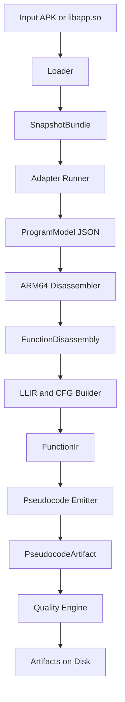
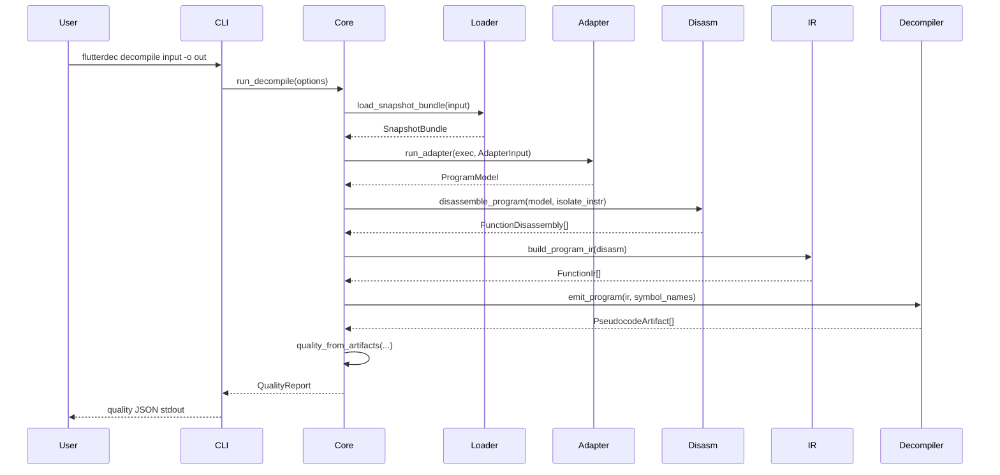

# How flutterdec Works

This document explains the internals of `flutterdec` in a practical way, so you can understand the system without reading all Rust code first.

## What the tool does

Input:

- Android APK with Flutter AOT
- `libapp.so` directly

Output:

- pseudo Dart files (`.dartpseudo`)
- optional assembly files (`.s`)
- optional IR files (`.json`)
- quality report (`quality.json`)
- summary report (`report.json`)

Main goal:

- recover readable behavior from Flutter AOT ARM64 binaries using static analysis

## End to end pipeline



## Command flow



## Runtime modes

`flutterdec` currently exposes five command families, each with a different internal path:

1. `info`
- fast metadata path
- loader always runs
- adapter runs only if installed for the detected hash
- APK inputs also run Android startup evidence extraction from `classes*.dex` and surface summary counts in JSON output
- no disassembly, no IR, no pseudocode writing

2. `decompile`
- full path from loader to pseudocode and quality gates
- writes artifacts under output directory
- may fail after writing artifacts if quality gates fail
- supports `--target` to narrow output to one function by id or entry VA
- target mode can override scope filtering when the function is not in the selected scope, and records this in `report.json.target_selection.scope_overridden`
- supports analysis-engine profiles: `balanced` (default) and `light`
- profile defaults can be overridden with per-feature `--with-*` / `--no-*` engine flags (canonical model symbols, pool hints, semantic reporting, bootflow category seeding)
- can ingest extra ELF symbol tables and `map-symbols` target JSON to improve direct call naming
- can also auto-ingest locally cached `map-symbols` target summaries by exact `libflutter.so` build-id match when `symbols/manifest.json` is present
- external descriptive names replace generic placeholders like `sub_*` and `fn_0x*` when addresses match
- auto-generated disassembler names such as `FUN_<hex>`, `nullsub_*`, `loc_*`, and `off_*` are also treated as generic placeholders during merge
- indirect `target_va` symbol rewrites apply the same generic-placeholder filter, so tool placeholders are not emitted as callable names
- pool target metadata now also emits deterministic `package_<pkg>_<Owner>_<method>` symbols for `package:*` libraries (not only `dart:*`/`package:flutter/*`)
- when stronger external names are available for the same VA, heuristic canonical names (`dart_*`/`flutter_*`/`package_*`) are replaced automatically
- recognized call names emit semantic intent comments (stdlib/runtime/native/package) next to call lines
- when intent is deterministic, callsites are rewritten to semantic paths and include `was: <original_name>` for traceability
- canonical `package_<pkg>_<Owner>_<method>` symbols are now rewritten to readable `pkg.Owner.method(...)` callsites with `package:<...>` intent tags
- package intent parsing now supports underscore-heavy owner/method tokens so generated call paths stay stable on sanitized class/method names
- framework intent parsing now supports underscore-heavy class/method tokens from sanitized machine names
- canonical Dart direct-call symbols preserve patch-library and owner segments in emitted semantic paths (for example `dart.core_patch.bool_patch.fromEnvironment` and `dart.typed_data.TypedData.offsetInBytes`)
- selector-backed intent can also rewrite indirect callsites and annotate `indirect via: <target_alias>`
- when a call argument is exactly `pool[<idx>]` and a string hint is known, it is rendered as `"value" /* pool[<idx>] */`
- non-exact pool expressions preserve structure and gain inline pool mapping comments (`pool[<idx> /* "value" */]`)
- selector intent coverage includes additional Flutter/Dart standards (for example `Stream.listen`, `Future.catchError`, `SchedulerBinding.addPostFrameCallback`, and `ChangeNotifier.addListener`)
- selector catalog now also covers more standard APIs such as `Navigator.pushNamed` and `List.removeAt`
- constructor-style standard selectors are recognized too (for example `flutter.widgets.KeyedSubtree.new`, `dart.async.StreamIterator.new`, `dart.typed_data.Float32x4List.new`)
- selector catalog now includes more `dart:io` and typed-data APIs (for example `Stdout.supportsAnsiEscapes`, `TypedData.offsetInBytes`, and `ByteData.setFloat32`)
- selector catalog now also includes internal stdlib constructor names such as `dart.io._NativeSocket.new` and `dart.core._CompileTimeError.new`
- selector catalog also includes internal std/core forms like `match_end_index` -> `dart.core.Match.end`
- internal selector names can also be matched directly when they are deterministic, such as `_current` -> `dart.core.Iterator.current` and `_equivalentYear` -> `dart.core.DateTime.equivalentYear`
- internal selector names can also map framework/runtime helpers when deterministic, such as `_listEquals` -> `flutter.foundation.listEquals` and `_prependTypeArguments` -> `dart_vm.prependTypeArguments`
- internal selector names can also map stdlib constructors when deterministic, such as `_StreamController` -> `dart.async.StreamController.new` and `_RawDatagramSocket` -> `dart.io.RawDatagramSocket.new`
- internal typed-data selector names can also map deterministic stdlib paths, such as `_nativeSetFloat32x4` -> `dart.typed_data.ByteData.setFloat32x4`, `_UnmodifiableUint8ArrayView` -> `dart.typed_data._UnmodifiableUint8ArrayView.new`, and `_Int32ArrayView` -> `dart.typed_data._Int32ArrayView.new`
- runtime helper selectors such as `yieldStarIterable` are now rewritten to runtime semantic paths (`runtime:dart_vm.*`)
- VM-internal constructor selectors such as `_Closure` and `_TypeParameter` are rewritten to runtime constructor paths (`dart_vm.*.new`)
- if selector evidence exists but no known standard mapping applies, indirect callsites use readable selector fallback forms: `dispatch.<selector>(...)` for general selectors and `<Selector>.new(...)` for constructor-like selectors (annotated with `heuristic: constructor-like selector`)
- selector evidence for indirect calls is inferred from both call arguments and indirect target expressions
- selector resolution also uses adapter pool metadata (`selector`, `owner_class`, `library_uri`) to build deterministic owner-qualified semantic paths
- owner-only metadata (`selector` + `owner_class` without `library_uri`) can still deterministically rewrite to owner-qualified call paths (`owner:Class.method`)
- missing selector/owner/library pool metadata can be backfilled from function ownership metadata (`target_va` -> function/class/library) before semantic resolution
- if pool metadata carries `target_va` and symbol resolution for that VA is non-generic, indirect callsites can rewrite through that symbol path with `target_va` traceability comments
- selector extraction ignores file/URI/path-like strings to reduce false-positive standard-call rewrites
- unresolved `dispatchTarget` callsites prefer semantic library invoke names when URI evidence exists (for example `flutter.widgets.invoke(...)` or `spotube.models.connect.load.invoke(...)`), otherwise use callable target form `<resolvedTarget>(...)` when the target expression is known, and only then use `dispatch.invoke(...)` fallback to reduce raw `dynamicCall(...)` noise
- noisy dispatch slot target expressions like `reg21.f0` are normalized behind a readable alias (`dispatchTargetFn`) before unresolved callable calls
- unresolved generic indirect aliases (for example `indirectTarget9`) now render as callable fallback `<target>(...)` before resorting to raw `dynamicCall(...)`
- stack-pointer offset arguments are normalized to slot notation (`sp[-0x10]`) so call arguments stay readable
- repeated read-only stack slots can be hoisted into named locals (for example `stackSlotNeg0x10`) to reduce repeated stack-offset noise
- wrapped member-access chains are normalized to cleaner dotted form when safe (for example `((((obj.f7)).f23)).f7` -> `obj.f7.f23.f7`)
- canonical names derived from adapter class/library ownership can deterministically label Flutter framework calls (`framework:flutter.*`), Dart stdlib calls (`stdlib:dart.*`), and package-owned calls (`package:*`)
- argument/local declaration typing uses deterministic context from semantic call ownership, constructor semantics (`*.new`), and literal assignments, allowing concrete types like `flutter.widgets.State`, `dart.async.Future`, `dart.async.StreamIterator`, `String`, and `bool` instead of defaulting to `dynamic`

3. `adapter`
- management path for adapter installation and listing
- does not inspect binaries directly

4. `map-symbols`
- compares a stripped and unstripped ARM64 ELF pair
- extracts function symbols from the unstripped binary
- scans direct call targets in the stripped binary and resolves them to exact/nearest symbols
- writes mapping artifacts under output directory

5. `engine-fingerprint`
- inspects ELF metadata, note sections, and marker strings
- emits build-id and version hints with a confidence score
- optional JSON artifact for reproducible comparisons

## Pipeline walkthrough with concrete contracts

This table shows what each stage consumes and produces.

| Stage | Consumes | Produces | Main code |
|---|---|---|---|
| Loader | APK or ELF bytes | `SnapshotBundle` | `crates/flutterdec-loader/src/lib.rs` |
| Adapter runner | `SnapshotBundle` slices + VAs | `ProgramModel` | `crates/flutterdec-adapter/src/lib.rs` |
| Disassembler | `ProgramModel.functions` + isolate instructions | `FunctionDisassembly[]` | `crates/flutterdec-disasm-arm64/src/lib.rs` |
| IR builder | `FunctionDisassembly[]` | `FunctionIr[]` | `crates/flutterdec-ir/src/lib.rs` |
| Decompiler | `FunctionIr[]` + symbol map | `PseudocodeArtifact[]` | `crates/flutterdec-decompiler/src/lib.rs` |
| Quality/reporting | model + disasm + pseudo + options | `QualityReport` + report files | `crates/flutterdec-core/src/lib.rs` and `crates/flutterdec-core/src/pipeline/*.rs` |

## Decompile lifecycle in pseudo code

This is the effective high-level control flow in `run_decompile`:

```text
bundle = load_snapshot_bundle(input)
model = run_adapter(resolve_adapter_exec(bundle.hash), bundle)
scoped_model = apply_scope_filter(model, function_scope, app_package_filters)
selected_model = apply_target_filter(scoped_model, model, target?)  // optional --target id/va

if selected_model.arch != "arm64":
    fail

disasm = disassemble_program(
    selected_model,
    bundle.isolate_instr,
    bundle.isolate_instr_va,
    target ? none : focus,
    target ? none : max_functions
)
ir = build_program_ir(disasm)
symbols = merge(selected_model.functions names, disasm names)
symbols = merge(extra ELF symbols, with generic-name replacement policy)
symbols = merge(extra symbol-map targets, exact-only unless nearest explicitly enabled)
symbols = normalize external names (demangle + canonical runtime/native/stdlib aliases)
symbols = canonicalize adapter-owned Dart/Flutter standard names from selected_model class/library metadata
pseudo = emit_program(ir, symbols)

write pseudocode files
optionally write asm files
optionally write ir files

quality = quality_from_artifacts(selected_model, disasm, pseudo, options)
write quality.json
write report.json

if !quality.passed:
    fail with path to quality.json
```

Important detail:

- quality evaluation happens after artifacts are generated
- this is intentional so failed runs still leave useful files for debugging

## Repository map

- `crates/flutterdec-cli`: command parsing and command dispatch
- `crates/flutterdec-core`: orchestration, file output, quality gates, stripped/unstripped call-target mapping, and ELF engine fingerprinting
- `crates/flutterdec-loader`: APK and ELF loading, snapshot symbol extraction
- `crates/flutterdec-adapter`: adapter process management and model contract
- `crates/flutterdec-disasm-arm64`: instruction decode and annotations
- `crates/flutterdec-ir`: LLIR construction and CFG recovery
- `crates/flutterdec-decompiler`: structured pseudo Dart emission and readability passes
- `adapters/python/adapter_template.py`: default adapter implementation
- `schemas/adapter.schema.json`: adapter JSON contract schema

## Data models

### SnapshotBundle

Produced by loader. Contains:

- snapshot bytes (`vm_data`, `isolate_data`)
- instructions bytes (`vm_instr`, `isolate_instr`)
- base virtual addresses for instruction images
- detected snapshot hash
- normalized arch (`arm64`)

Example shape:

```text
SnapshotBundle {
  input_path: ".../app.apk",
  libapp_path: "lib/arm64-v8a/libapp.so",
  arch: "arm64",
  snapshot_hash: "63f9...abcd",
  vm_data: Vec<u8>,
  isolate_data: Vec<u8>,
  vm_instr: Vec<u8>,
  isolate_instr: Vec<u8>,
  vm_instr_va: 0x....
  isolate_instr_va: 0x....
}
```

### ProgramModel

Produced by adapter. Main fields:

- `schema_version`
- `adapter_kind`
- `dart_version`
- `snapshot_hash`
- `arch`
- `libraries[]`
- `classes[]`
- `functions[]`
- `object_pool[]`

Schema compatibility:

- v2 and v3 are accepted by core
- v3 adds richer semantic metadata while preserving v2 compatibility defaults

Minimal example:

```json
{
  "schema_version": 3,
  "adapter_kind": "dynamic_snapshot_string_model_v1",
  "dart_version": "unknown",
  "snapshot_hash": "63f9...abcd",
  "arch": "arm64",
  "libraries": [{"id": 0, "uri": "package:app/main.dart", "name_display": "package:app/main.dart"}],
  "classes": [{"id": 0, "name": "Global", "super": "Object", "lib": "package:app/main.dart"}],
  "functions": [{"id": 0, "name": "sub_656c1c", "owner_class": "Global", "entry_va": 6640668, "size": 320, "code_section_va": 6635520, "name_kind": "placeholder"}],
  "object_pool": [{"index": 0, "kind": "String", "value": "package:app/main.dart", "decoded_kind": "LibraryUri", "library_uri": "package:app/main.dart", "confidence": 0.4, "source": "internal"}]
}
```

### FunctionDisassembly

Produced by disassembler. Per function:

- function metadata (`id`, `name`, `entry_va`, `size`)
- decoded instruction list (`AsmInstruction[]`)
- per instruction annotation (`call`, `branch`, `return`, `pool[...]`, empty)

Example instruction:

```json
{
  "va": 6640704,
  "word": 2545131072,
  "mnemonic": "bl",
  "op_str": "#0xea32e8",
  "annotation": "call"
}
```

### FunctionIr

Produced by IR builder. Contains:

- basic blocks
- block leader addresses
- block successors and predecessors
- LLIR instruction categories (`Call`, `Branch`, `Jump`, `Return`, `LoadPool`, `Other`)

Design note:

- IR is intentionally low-risk and predictable
- no aggressive graph rewriting at this stage
- most readability work is deferred to the decompiler

### PseudocodeArtifact

Produced by decompiler. Contains:

- full pseudo source text
- per function counters for control flow and call quality

The counters let the quality engine detect regressions without parsing ASTs.

## Stage by stage internals

## 1) Loader

Main tasks:

- if input is APK, locate `libapp.so` in `lib/arm64-v8a/` or fallback paths
- parse ELF symbols
- locate Flutter snapshot symbols:
  - `_kDartVmSnapshotData`
  - `_kDartIsolateSnapshotData`
  - `_kDartVmSnapshotInstructions`
  - `_kDartIsolateSnapshotInstructions`
- convert VA to file offsets
- extract byte ranges
- detect snapshot hash from snapshot headers

Key implementation details:

- APK mode scans preferred lib paths first, then fallback file names
- ELF symbol lookup merges dynamic and static symbol tables
- symbol VA is converted to file offset through program headers
- symbol spans are bounds checked against file size before slicing

Key functions:

- `load_snapshot_bundle`
- `find_libapp_in_apk`
- `collect_symbols`
- `read_symbol_span`
- `detect_snapshot_hash`

Failure modes:

- missing `libapp.so`
- unsupported machine type
- missing or zero-sized symbols

## 2) Adapter runner

The adapter is process based. Core writes input binaries to temp files, runs adapter executable, and reads `model.json`.

The current Python template adapter:

- extracts strings from snapshot data
- guesses libraries from `package:...dart` strings
- recovers function starts with simple ARM64 heuristics
- builds object pool from extracted strings
- can run in `auto|internal|blutter` backend mode (Blutter first in `auto` when configured)
- in Blutter mode, parses `asm/*.dart` and `pp.txt` and synthesizes `EntryPointCandidate` pool metadata for `main`/`runApp`-like functions
- emits schema version 2 JSON

Validation in Rust enforces:

- schema version equals 2
- arch equals `arm64`
- non-empty function list

Execution model:

- core creates temporary files for snapshot blobs
- adapter is invoked as a child process with explicit file paths
- adapter writes JSON to output path
- Rust side parses and validates that JSON

Why process-based adapters:

- keeps parser logic isolated from core binary
- allows faster adapter iteration in Python
- makes version-specific parser replacement simple

Key functions:

- `run_adapter`
- `resolve_adapter_exec`
- `install_adapter`
- `validate_model`

## 3) Disassembler

Uses Capstone ARM64 mode.

Important behavior:

- emits best effort disassembly; if decode fails, uses raw 4-byte words
- tags instruction classes:
  - direct or indirect call
  - jump
  - conditional branch
  - return
- detects pool loads from `ldr` patterns on `x27` and annotates as `pool[index]`

Filtering behavior:

- `focus_prefix` can restrict functions by name or owner class prefix
- `max_functions` bounds output volume for fast sampling runs

Fallback behavior:

- if Capstone is unavailable or decode fails, function bytes are emitted as 4-byte words
- pipeline continues instead of crashing

Key functions:

- `disassemble_program`
- `decode_function`
- `annotation_for`

## 4) IR and CFG

IR builder is intentionally simple and deterministic:

- classify each asm instruction into LLIR op kind
- detect block leaders:
  - function entry
  - branch and jump targets
  - fallthrough after branch
- build blocks by VA ranges
- derive CFG edges from terminator behavior

This keeps CFG generation stable even with partial instruction quality.

Leader and edge logic:

- branch target becomes leader
- branch fallthrough becomes leader
- jump target becomes leader
- return has no outgoing edge
- non-terminator block falls through to next block

Key functions:

- `build_function_ir`
- `build_program_ir`
- `llir_from_disasm`

## 5) Decompiler and readability pipeline

The decompiler has two layers:

1. lifting while walking blocks:
- register value tracking
- comparison tracking for condition reconstruction
- basic memory and local handling
- call emission for direct and indirect targets

2. post processing passes:
- helper inlining and helper collapse
- loop header wrapping into preliminary `while (true)` scaffolds
- unwrapping synthetic single-iteration `while (true)` wrappers with no `continue`
- hoisting `else` blocks after terminating `if` branches
- collapsing redundant guarded returns with identical fallthrough returns
- collapsing nested/trailing guarded-return stacks that always end in the same return value
- removing redundant repeated null guards after terminating null checks
- merging nested single-guard `if` blocks
- merging consecutive `continue` guards into combined conditions
- rewriting return/continue comparator pairs into bounded continue ranges
- rewriting multi-continue infinite loops into retry-flag loops
- unwrapping retry loops that no longer have retry paths
- arithmetic simplification
- normalizing negated comparisons (`!((a) != b)` -> `((a) == b)`)
- removing redundant outer parentheses in `if` conditions after expression rewrites
- naming and type hinting
- extracting stable repeated `(<value> - 1)` expressions into aliases (for example `codePoint`)
- compacting empty or redundant control flow patterns

Important pass ordering:

1. emit base pseudocode from block walk
2. append helper bodies for omitted blocks
3. inline trivial helpers
4. collapse remaining helper scaffolding
5. insert loop back-edge summaries
6. compact empty or redundant patterns (iterative, up to 16 passes)
7. clean expressions
8. apply naming and type hints
9. extract repeated stable arithmetic aliases

Why this ordering matters:

- helper and loop summaries must run before compaction
- naming should run near the end so it sees near-final text
- expression cleanup should run before naming aliases to avoid odd token interactions

Recent readability features include:

- semantic indirect targets:
  - `dispatchTarget`, `cachedTarget`, `indirectTargetN`
- semantic register aliases:
  - `returnAddress`, `framePointer`
- stack slot notation:
  - `sp[-8]`, `sp[8]`
  - stack-derived base expressions collapse to indexed slots (`((sp - 0x30)).f0` to `sp[-0x30]`)
- arithmetic simplification:
  - `(null + 0x20)` to `0x20`
  - `((sp - 0x20) + 0x10)` to `(sp - 0x10)`
- empty branch folding:
  - `if (cond) { } else { body }` to `if (!(cond)) { body }`
- identical branch return folding:
  - `if (cond) { return x; } else { return x; }` to `return x;`
- redundant guarded return folding:
  - `if (cond) { return x; } return x;` to `return x;`
- nested/trailing same-return guard folding:
  - `if (g1) { return null; } if (g2) { return null; } return null;` to `return null;`
- terminating-branch else hoisting:
  - `if (cond) { return x; } else { body }` to `if (cond) { return x; } body`
- redundant null-check elimination:
  - `if (v == null) { return x; } ... if (v == null) { continue; }` removes the second check when `v` was not reassigned
- nested guard merge:
  - `if (a) { if (b) { body } }` to `if ((a) && (b)) { body }`
- continue-guard merge:
  - `if (c1) { continue; } if (c2) { continue; }` to `if ((c1) || (c2)) { continue; }`
- comparator range compaction:
  - `if (x > K) { return r; } if (x >= L) { continue; }` to bounded continue range plus upper-tail return
- retry-loop rewrite:
  - `while (true)` loops with many `continue` edges become `while (retryLoopN)` using a retry flag initialized to true
  - dead fall-through updates that appear after a guaranteed `return` are pruned as unreachable
  - retry wrappers with no remaining retry paths are unwrapped back to straight-line code
- terminal tail pruning:
  - statements after `return`, `continue`, or `break` in the same block are removed until block close
- negated comparison normalization:
  - `!((a) != b)` to `((a) == b)` and `!((a) == b)` to `((a) != b)`
- condition wrapper cleanup:
  - `if (((x == y))) {` to `if (x == y) {`
- repeated minus-one alias extraction:
  - repeated `(value3 - 1)` style expressions become a named alias such as `final int codePoint = (value3 - 1);`
- early loop structuring:
  - detect loop headers from backward CFG edges
  - emit `while (true)` with `continue` for back-edge paths
- loop wrapper cleanup:
  - remove `while (true)` wrappers that have no `continue` and end with a plain `break`
  - remove `while (true)` wrappers with no `continue` when the body already terminates at top level

Fallback policy for complex unresolved regions:

- summarize omitted paths once per function
- return safe fallback values where needed
- do not emit fake structure that implies false confidence

Key functions:

- `emit_pseudocode`
- `emit_block`
- `emit_call`
- `compact_lines`
- `apply_name_and_type_hints`

## 6) Quality engine

`quality.json` is computed from generated pseudocode and disassembly coverage.

Current metrics include:

- `disassembly_ratio`
- `placeholder_ifs`
- `unresolved_cf`
- `indirect_call_ratio`
- `semantic_direct_calls`
- `semantic_indirect_calls`
- `dispatch_selector_calls`
- `target_va_symbol_calls`
- `block_helper_refs`
- `raw_arg_name_refs`
- `raw_register_name_refs`
- `placeholder_cond_markers`
- `omitted_path_markers`
- `loop_backedge_markers`

The run fails when thresholds are violated.

`report.json` also includes a `semantic_rewrite` aggregate section with direct/indirect/fallback/target-va-symbol counts and ratios.
`report.json` also includes a `semantic_intent` aggregate section with framework/stdlib/runtime/native counts, selector-tagged count, and constructor-call count.
`report.json` also includes `selector_fallback` diagnostics with total/unique unresolved selector fallback counts, top selector names, and sample call lines.
`report.json` also includes `call_fallback` diagnostics for `dynamicCall(...)`, `dispatch.invoke(...)`, `dispatchTarget` non-dispatch fallback call forms (`<target>(...)` and semantic library `*.invoke(...)`), and generic `indirectTargetN(...)` fallback forms.
`report.json` also includes `bootflow_discovery` diagnostics with deterministic categorized candidates (`main`, `runapp`, `deeplink`, `activity`, `bootstrap`) sourced from adapter metadata and selector evidence.
Activity/bootstrap candidate synthesis is context-aware (owner/library gating), and overlapping category hits with the same target/selector are deduplicated.
`report.json` also includes `android_manifest` diagnostics (APK inputs): parse mode (`binary_axml` or heuristic fallback), per-signal confidence (`high`/`medium`/`low`), launcher/deeplink flags, manifest activity candidates, deeplink entries, parse errors, and the number of manifest-derived synthetic bootflow hints injected into the model.

Metric formulas:

- `disassembly_ratio = disassembled_function_count / function_count`
- `indirect_call_ratio = indirect_calls / total_calls`

Gate mapping to CLI options:

- `--max-placeholder-ifs` -> max allowed `placeholder_ifs`
- `--max-unresolved-cf` -> max allowed `unresolved_cf`
- `--max-indirect-call-ratio` -> max allowed `indirect_call_ratio`
- `--min-disassembly-ratio` -> min allowed `disassembly_ratio`

Default strict profile comes from CLI defaults in `DecompileCmd`.

Interpretation guidance:

- high `omitted_path_markers` usually means structuring depth limits were hit
- high `loop_backedge_markers` means loop recovery still needs work for unstructured cases
- high `raw_register_name_refs` means naming pass regressed

## Output layout

`decompile -o out_dir` writes:

- `out_dir/pseudocode/*.dartpseudo`
- `out_dir/asm/*.s` (when `--emit-asm`)
- asm lines include raw opcode words when `--emit-asm-opcodes` is set
- `out_dir/ghidra_apply_symbols.py` (when `--emit-ghidra-script`)
- `out_dir/ida_apply_symbols.py` (when `--emit-ida-script`)
- `out_dir/ir/*.json` (when `--emit-ir`)
- `out_dir/quality.json`
- `out_dir/report.json`

File naming convention:

- pseudocode: `{function_id:05}_{sanitized_name}.dartpseudo`
- asm: `{function_id:05}_{sanitized_name}.s`
- ir: `{function_id:05}_{sanitized_name}.json`

`report.json` includes:

- input metadata
- counts for libraries, classes, functions, pool entries
- `adapter_schema.function_name_kind_breakdown` (exact/external/heuristic/placeholder/unknown/unspecified)
- `adapter_selection` trace (requested backend, resolved backend, adapter exec, manifest mapping, snapshot hash match, and strict hash-match enforcement flag)
- `compatibility` summary (adapter schema support, manifest-entry presence, snapshot hash alignment, and warning list)
- embedded `quality` object
- `name_resolution` aggregate (final name-quality mix and merge replacement diagnostics)
- `pool_value_hints`, `pool_semantic_hints`, and `pool_target_symbols` counts
- `semantic_rewrite` aggregate
- `semantic_intent` aggregate
- `selector_fallback` aggregate
- `call_fallback` aggregate
- `ghidra_script` output metadata (`enabled`, path, symbol count, and pool-comment count)
- `ida_script` output metadata (`enabled`, path, symbol count, and pool-comment count)
- `engine_fingerprint_context` (best-effort `libflutter.so` fingerprint metadata and errors when unavailable)
- `bootflow_discovery` aggregate (source-tagged entries from adapter, manifest, and APK-startup evidence; startup-derived entries can be targetless when no Dart VA is available yet)
- `android_manifest` aggregate
- `android_startup` aggregate (APK bytecode startup evidence from `classes*.dex`, including embedding calls, JNI/bootstrap stages, parse errors, and recovered `DartEntrypoint` callsites when present)
- recovered `android_startup.dart_entrypoints` records can include literal `function_name`, `library_uri`, and `app_bundle_path` values when constructor/execute arguments are directly backed by `const-string` plus simple register propagation
- `android_startup.bootstrap_chain` aggregate (best observed startup-chain completeness plus per-source ordered stages, owner kind, missing-step diagnostics, and correlated `paths` when APK bytecode exposes app-defined method edges between activity/engine/bootstrap code)
- `function_scope.priority_package_hints` (effective package boosts used by capped prioritization)
- `prioritization.selected_package_counts_top` and `prioritization.selected_unknown_library_count` (selected top-N ownership mix)
- `prioritization.selected_scope_mix` and `prioritization.selected_app_like_ratio` (selected top-N scope quality)
- `prioritization.selected_preferred_app_count`, `selected_other_app_count`, and `selected_preferred_app_ratio` (selected app-package precision against preferred hints)
- `prioritization.selected_component_totals_top` (which score components dominated capped selection)
- capped prioritization now applies extra context scoring to startup-frontier functions so app-owned bootstrap-adjacent code outranks framework/bootstrap noise when both are visible
- `prioritization.selected_bootflow_coverage` (how much discovered main/runApp/deeplink/activity/bootstrap bootflow is represented in selected top-N)
- `prioritization.selected_bootflow_hits_top` (top selected functions that matched bootflow targets)

## How `info` differs from `decompile`

`info`:

- always runs loader
- checks whether adapter is installed
- optionally runs adapter to populate counts
- does not create output directories

`decompile`:

- runs full pipeline
- always writes output artifacts
- enforces quality gates at end

## Mental model for extension

If you want to improve results, treat each stage independently:

1. loader correctness
2. adapter model fidelity
3. disassembler annotation quality
4. CFG quality
5. pseudocode readability
6. quality gates and thresholds

This split is intentional. It lets you improve one stage without destabilizing the whole system.

## Adding support for a new snapshot hash

1. create or install adapter entry for hash
2. ensure adapter emits schema version 2
3. run:

```bash
flutterdec adapter install --dart-hash <hash>
flutterdec decompile app.apk -o out
```

4. inspect:

- `out/quality.json`
- `out/pseudocode/*`

5. iterate on adapter and decompiler passes

## Debugging checklist

If output quality is poor:

1. confirm loader found correct symbols and instruction bases
2. verify adapter returned realistic function starts and sizes
3. compare disassembly output with expected control flow
4. inspect IR blocks and successors for bad splits
5. inspect pseudocode counters in quality report
6. add focused regression tests in decompiler or IR crate

## Debugging by symptom

Symptom: `adapter not installed for hash ...`

- run `flutterdec adapter install --dart-hash <hash>`
- verify with `flutterdec adapter list`

Symptom: quality gate fails with low disassembly ratio

- increase sample size with `--max-functions`
- check adapter function boundaries
- inspect emitted asm for many fallback `word` instructions

Symptom: capped `--max-functions` output is dominated by runtime helper paths

- keep `--function-scope app-unknown` (default) or tighten with `--function-scope app`
- inspect `report.json` -> `prioritization.selected[*]` for ranking reasons (`components`) and package/library ownership (`library_uri`)
- if needed, set explicit `--app-package <name>`; otherwise decompile derives package hints from `AndroidManifest.xml` when available (including normalized suffix variants such as `_app`/`_flutter`)
- when package hints are present, non-preferred third-party packages are also downranked, so app package functions should dominate capped selections
- note: scorer downranks explicit `no isolate` markers and `dart:isolate*` library paths by default
- capped mode also seeds one function per discovered bootflow category (`main`, `runapp`, `deeplink`, `activity`, `bootstrap`) before normal diversity selection

Symptom: pseudocode has too many omitted path summaries

- inspect large CFG functions in IR output (`--emit-ir`)
- tune decompiler visit limits or helper inlining logic

Symptom: function names are too synthetic

- improve adapter metadata extraction first
- then run `map-symbols` on stripped/unstripped pairs and either feed `symbol_target_summary.json` into `decompile --extra-symbol-map-targets ...` or register it into the local cache with `--register-local-cache`

Symptom: control flow is valid but hard to read

- focus on compaction and naming passes in decompiler
- add regression tests with small synthetic CFGs before real APK testing

## Testing strategy

Current project testing style:

- focused unit tests in each crate
- many behavior tests in `flutterdec-decompiler`
- golden snapshot tests in `crates/flutterdec-decompiler/testdata/golden/` for readability-sensitive output
- optional real-binary golden checks via `scripts/real-golden.sh` (single profile) or `scripts/real-golden-matrix.sh` (multi profile) with baselines in `testdata/real-golden/`
- real-binary baselines now also compare `report_metrics.json`, which extracts startup, bootflow, entrypoint, and engine-symbol-ingestion metrics from `report.json`
- regular real-binary smoke validation for output quality

Recommended loop when changing internals:

1. add or update unit test for the exact behavior
2. run crate-local tests
3. run workspace tests
4. run real APK sample with relaxed thresholds
5. compare `quality.json`, `report_metrics.json`, and representative pseudocode files

When readability output changes intentionally, refresh golden snapshots:

```bash
FLUTTERDEC_UPDATE_GOLDEN=1 cargo test -p flutterdec-decompiler golden_
```

For end-to-end real-binary checks against a recorded baseline:

```bash
scripts/real-golden.sh check --input /path/to/sample.apk --baseline testdata/real-golden/profiles/sample --max-functions 120 --min-disassembly-ratio 0.0
```

For multi-profile checks driven by `profile.env` files:

```bash
scripts/real-golden-matrix.sh check
scripts/real-golden-matrix.sh check --strict
```

## Known limits

- ARM64 only
- no full Dart syntax reconstruction yet
- some complex loops are summarized, not fully structured
- some complex branches are summarized as omitted paths
- naming is heuristic when metadata is obfuscated

## Suggested reading order

If you still want to inspect code after this guide:

1. `crates/flutterdec-core/src/lib.rs` and `crates/flutterdec-core/src/pipeline/*.rs`
2. `crates/flutterdec-loader/src/lib.rs`
3. `crates/flutterdec-adapter/src/lib.rs`
4. `crates/flutterdec-disasm-arm64/src/lib.rs`
5. `crates/flutterdec-ir/src/lib.rs`
6. `crates/flutterdec-decompiler/src/lib.rs`

Recommended newcomer route:

1. read this file once top to bottom
2. run one `info` command and one `decompile` command
3. inspect one function across asm, ir, and pseudocode outputs
4. then open the code files in the reading order above

Decompiler source layout:

- `crates/flutterdec-decompiler/src/lib.rs`: top-level orchestration and artifact assembly
- `crates/flutterdec-decompiler/src/control_flow.rs`: CFG flow entrypoint
- `crates/flutterdec-decompiler/src/control_flow/expression_lift.rs`: instruction lifting and operand reconstruction
- `crates/flutterdec-decompiler/src/control_flow/graph.rs`: branch conditions, target resolution, and loop-header wrapping decisions
- `crates/flutterdec-decompiler/src/control_flow/emit.rs`: call emission and recursive block emission
- `crates/flutterdec-decompiler/src/passes.rs`: readability pass entrypoint
- `crates/flutterdec-decompiler/src/passes/compaction.rs`: loop/guard compaction and structural simplification
- `crates/flutterdec-decompiler/src/passes/structural_helpers.rs`: structural helper entrypoint
- `crates/flutterdec-decompiler/src/passes/structural_helpers/block_and_conditions.rs`: block parsing and branch condition helpers
- `crates/flutterdec-decompiler/src/passes/structural_helpers/guard_and_flow.rs`: guarded-return, null-check, and top-level flow helpers
- `crates/flutterdec-decompiler/src/passes/structural_helpers/naming_support.rs`: identifier replacement/stats and alias-support helpers
- `crates/flutterdec-decompiler/src/passes/naming.rs`: variable naming, alias extraction, and type hints
- `crates/flutterdec-decompiler/src/passes/expr_cleanup.rs`: expression cleanup and comparison rewrites
- `crates/flutterdec-decompiler/src/helper_flow.rs`: helper-flow entrypoint
- `crates/flutterdec-decompiler/src/helper_flow/parse.rs`: helper parsing and helper-shape detection
- `crates/flutterdec-decompiler/src/helper_flow/inlining.rs`: helper inlining/collapse flow
- `crates/flutterdec-decompiler/src/helper_flow/summary.rs`: loop-summary insertion, visit-limit policy, and helper function materialization
- `crates/flutterdec-decompiler/src/helpers.rs`: helper utility entrypoint
- `crates/flutterdec-decompiler/src/helpers/registers.rs`: register canonicalization and zero-register helpers
- `crates/flutterdec-decompiler/src/helpers/expr.rs`: integer parsing and expression simplification helpers
- `crates/flutterdec-decompiler/src/helpers/instruction_parse.rs`: instruction and operand parsing helpers
- `crates/flutterdec-decompiler/src/helpers/naming.rs`: local and target naming helpers
- `crates/flutterdec-decompiler/src/helpers/state_and_flow.rs`: lift-state initialization, stack-offset collection, and cmp-to-branch condition helpers
- `crates/flutterdec-decompiler/src/tests.rs`: decompiler regression test entrypoint
- `crates/flutterdec-decompiler/src/tests/*.rs`: grouped decompiler regression suites and shared fixtures
