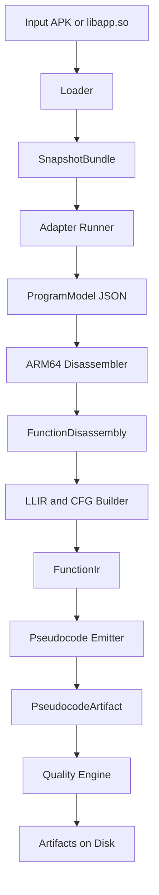
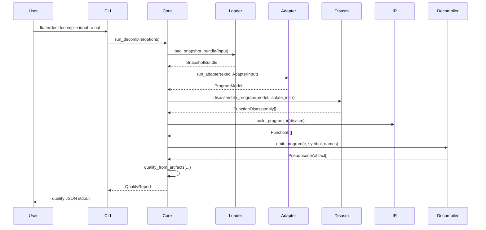

# How flutterdec Works

This document explains the internals of `flutterdec` in a practical way, so you can understand the system without reading all Rust code first.

## What the tool does

Input:

- Android APK with Flutter AOT
- `libapp.so` directly

Output:

- pseudo Dart files (`.dartpseudo`)
- optional assembly files (`.s`)
- optional IR files (`.json`)
- quality report (`quality.json`)
- summary report (`report.json`)

Main goal:

- recover readable behavior from Flutter AOT ARM64 binaries using static analysis

## End to end pipeline



## Command flow



## Repository map

- `crates/flutterdec-cli`: command parsing and command dispatch
- `crates/flutterdec-core`: orchestration, file output, quality gates
- `crates/flutterdec-loader`: APK and ELF loading, snapshot symbol extraction
- `crates/flutterdec-adapter`: adapter process management and model contract
- `crates/flutterdec-disasm-arm64`: instruction decode and annotations
- `crates/flutterdec-ir`: LLIR construction and CFG recovery
- `crates/flutterdec-decompiler`: structured pseudo Dart emission and readability passes
- `adapters/python/adapter_template.py`: default adapter implementation
- `schemas/adapter.schema.json`: adapter JSON contract schema

## Data models

### SnapshotBundle

Produced by loader. Contains:

- snapshot bytes (`vm_data`, `isolate_data`)
- instructions bytes (`vm_instr`, `isolate_instr`)
- base virtual addresses for instruction images
- detected snapshot hash
- normalized arch (`arm64`)

### ProgramModel

Produced by adapter. Main fields:

- `schema_version`
- `adapter_kind`
- `dart_version`
- `snapshot_hash`
- `arch`
- `libraries[]`
- `classes[]`
- `functions[]`
- `object_pool[]`

### FunctionDisassembly

Produced by disassembler. Per function:

- function metadata (`id`, `name`, `entry_va`, `size`)
- decoded instruction list (`AsmInstruction[]`)
- per instruction annotation (`call`, `branch`, `return`, `pool[...]`, empty)

### FunctionIr

Produced by IR builder. Contains:

- basic blocks
- block leader addresses
- block successors and predecessors
- LLIR instruction categories (`Call`, `Branch`, `Jump`, `Return`, `LoadPool`, `Other`)

### PseudocodeArtifact

Produced by decompiler. Contains:

- full pseudo source text
- per function counters for control flow and call quality

## Stage by stage internals

## 1) Loader

Main tasks:

- if input is APK, locate `libapp.so` in `lib/arm64-v8a/` or fallback paths
- parse ELF symbols
- locate Flutter snapshot symbols:
  - `_kDartVmSnapshotData`
  - `_kDartIsolateSnapshotData`
  - `_kDartVmSnapshotInstructions`
  - `_kDartIsolateSnapshotInstructions`
- convert VA to file offsets
- extract byte ranges
- detect snapshot hash from snapshot headers

Failure modes:

- missing `libapp.so`
- unsupported machine type
- missing or zero-sized symbols

## 2) Adapter runner

The adapter is process based. Core writes input binaries to temp files, runs adapter executable, and reads `model.json`.

The current Python template adapter:

- extracts strings from snapshot data
- guesses libraries from `package:...dart` strings
- recovers function starts with simple ARM64 heuristics
- builds object pool from extracted strings
- emits schema version 2 JSON

Validation in Rust enforces:

- schema version equals 2
- arch equals `arm64`
- non-empty function list

## 3) Disassembler

Uses Capstone ARM64 mode.

Important behavior:

- emits best effort disassembly; if decode fails, uses raw 4-byte words
- tags instruction classes:
  - direct or indirect call
  - jump
  - conditional branch
  - return
- detects pool loads from `ldr` patterns on `x27` and annotates as `pool[index]`

## 4) IR and CFG

IR builder is intentionally simple and deterministic:

- classify each asm instruction into LLIR op kind
- detect block leaders:
  - function entry
  - branch and jump targets
  - fallthrough after branch
- build blocks by VA ranges
- derive CFG edges from terminator behavior

This keeps CFG generation stable even with partial instruction quality.

## 5) Decompiler and readability pipeline

The decompiler has two layers:

1. lifting while walking blocks:
- register value tracking
- comparison tracking for condition reconstruction
- basic memory and local handling
- call emission for direct and indirect targets

2. post processing passes:
- helper inlining and helper collapse
- loop back-edge summarization
- arithmetic simplification
- naming and type hinting
- compacting empty or redundant control flow patterns

Recent readability features include:

- semantic indirect targets:
  - `dispatchTarget`, `cachedTarget`, `indirectTargetN`
- semantic register aliases:
  - `returnAddress`, `framePointer`
- stack slot notation:
  - `sp[-8]`, `sp[8]`
- arithmetic simplification:
  - `(null + 0x20)` to `0x20`
  - `((sp - 0x20) + 0x10)` to `(sp - 0x10)`
- empty branch folding:
  - `if (cond) { } else { body }` to `if (!(cond)) { body }`

Fallback policy for complex unresolved regions:

- summarize omitted paths once per function
- return safe fallback values where needed
- do not emit fake structure that implies false confidence

## 6) Quality engine

`quality.json` is computed from generated pseudocode and disassembly coverage.

Current metrics include:

- `disassembly_ratio`
- `placeholder_ifs`
- `unresolved_cf`
- `indirect_call_ratio`
- `block_helper_refs`
- `raw_arg_name_refs`
- `raw_register_name_refs`
- `placeholder_cond_markers`
- `omitted_path_markers`
- `loop_backedge_markers`

The run fails when thresholds are violated.

## Output layout

`decompile -o out_dir` writes:

- `out_dir/pseudocode/*.dartpseudo`
- `out_dir/asm/*.s` (when `--emit-asm`)
- `out_dir/ir/*.json` (when `--emit-ir`)
- `out_dir/quality.json`
- `out_dir/report.json`

## Mental model for extension

If you want to improve results, treat each stage independently:

1. loader correctness
2. adapter model fidelity
3. disassembler annotation quality
4. CFG quality
5. pseudocode readability
6. quality gates and thresholds

This split is intentional. It lets you improve one stage without destabilizing the whole system.

## Adding support for a new snapshot hash

1. create or install adapter entry for hash
2. ensure adapter emits schema version 2
3. run:

```bash
flutterdec adapter install --dart-hash <hash>
flutterdec decompile app.apk -o out
```

4. inspect:

- `out/quality.json`
- `out/pseudocode/*`

5. iterate on adapter and decompiler passes

## Debugging checklist

If output quality is poor:

1. confirm loader found correct symbols and instruction bases
2. verify adapter returned realistic function starts and sizes
3. compare disassembly output with expected control flow
4. inspect IR blocks and successors for bad splits
5. inspect pseudocode counters in quality report
6. add focused regression tests in decompiler or IR crate

## Known limits

- ARM64 only
- no full Dart syntax reconstruction yet
- some complex loops are summarized, not fully structured
- some complex branches are summarized as omitted paths
- naming is heuristic when metadata is obfuscated

## Suggested reading order

If you still want to inspect code after this guide:

1. `crates/flutterdec-core/src/lib.rs`
2. `crates/flutterdec-loader/src/lib.rs`
3. `crates/flutterdec-adapter/src/lib.rs`
4. `crates/flutterdec-disasm-arm64/src/lib.rs`
5. `crates/flutterdec-ir/src/lib.rs`
6. `crates/flutterdec-decompiler/src/lib.rs`
