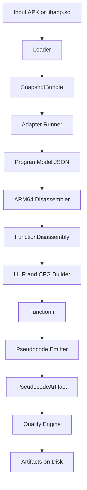
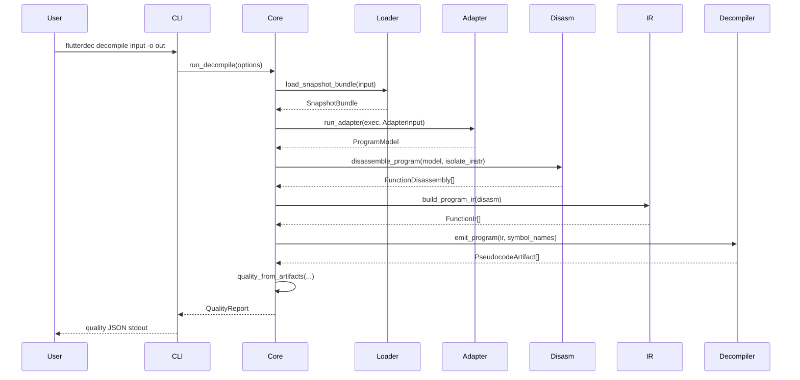

# How flutterdec Works

This document explains the internals of `flutterdec` in a practical way, so you can understand the system without reading all Rust code first.

## What the tool does

Input:

- Android APK with Flutter AOT
- `libapp.so` directly

Output:

- pseudo Dart files (`.dartpseudo`)
- optional assembly files (`.s`)
- optional IR files (`.json`)
- quality report (`quality.json`)
- summary report (`report.json`)

Main goal:

- recover readable behavior from Flutter AOT ARM64 binaries using static analysis

## End to end pipeline



## Command flow



## Runtime modes

`flutterdec` currently exposes three command families, each with a different internal path:

1. `info`
- fast metadata path
- loader always runs
- adapter runs only if installed for the detected hash
- no disassembly, no IR, no pseudocode writing

2. `decompile`
- full path from loader to pseudocode and quality gates
- writes artifacts under output directory
- may fail after writing artifacts if quality gates fail

3. `adapter`
- management path for adapter installation and listing
- does not inspect binaries directly

## Pipeline walkthrough with concrete contracts

This table shows what each stage consumes and produces.

| Stage | Consumes | Produces | Main code |
|---|---|---|---|
| Loader | APK or ELF bytes | `SnapshotBundle` | `crates/flutterdec-loader/src/lib.rs` |
| Adapter runner | `SnapshotBundle` slices + VAs | `ProgramModel` | `crates/flutterdec-adapter/src/lib.rs` |
| Disassembler | `ProgramModel.functions` + isolate instructions | `FunctionDisassembly[]` | `crates/flutterdec-disasm-arm64/src/lib.rs` |
| IR builder | `FunctionDisassembly[]` | `FunctionIr[]` | `crates/flutterdec-ir/src/lib.rs` |
| Decompiler | `FunctionIr[]` + symbol map | `PseudocodeArtifact[]` | `crates/flutterdec-decompiler/src/lib.rs` |
| Quality/reporting | model + disasm + pseudo + options | `QualityReport` + report files | `crates/flutterdec-core/src/lib.rs` |

## Decompile lifecycle in pseudo code

This is the effective high-level control flow in `run_decompile`:

```text
bundle = load_snapshot_bundle(input)
model = run_adapter(resolve_adapter_exec(bundle.hash), bundle)

if model.arch != "arm64":
    fail

disasm = disassemble_program(model, bundle.isolate_instr, bundle.isolate_instr_va, focus, max_functions)
ir = build_program_ir(disasm)
symbols = merge(model.functions names, disasm names)
pseudo = emit_program(ir, symbols)

write pseudocode files
optionally write asm files
optionally write ir files

quality = quality_from_artifacts(model, disasm, pseudo, options)
write quality.json
write report.json

if !quality.passed:
    fail with path to quality.json
```

Important detail:

- quality evaluation happens after artifacts are generated
- this is intentional so failed runs still leave useful files for debugging

## Repository map

- `crates/flutterdec-cli`: command parsing and command dispatch
- `crates/flutterdec-core`: orchestration, file output, quality gates
- `crates/flutterdec-loader`: APK and ELF loading, snapshot symbol extraction
- `crates/flutterdec-adapter`: adapter process management and model contract
- `crates/flutterdec-disasm-arm64`: instruction decode and annotations
- `crates/flutterdec-ir`: LLIR construction and CFG recovery
- `crates/flutterdec-decompiler`: structured pseudo Dart emission and readability passes
- `adapters/python/adapter_template.py`: default adapter implementation
- `schemas/adapter.schema.json`: adapter JSON contract schema

## Data models

### SnapshotBundle

Produced by loader. Contains:

- snapshot bytes (`vm_data`, `isolate_data`)
- instructions bytes (`vm_instr`, `isolate_instr`)
- base virtual addresses for instruction images
- detected snapshot hash
- normalized arch (`arm64`)

Example shape:

```text
SnapshotBundle {
  input_path: ".../app.apk",
  libapp_path: "lib/arm64-v8a/libapp.so",
  arch: "arm64",
  snapshot_hash: "63f9...abcd",
  vm_data: Vec<u8>,
  isolate_data: Vec<u8>,
  vm_instr: Vec<u8>,
  isolate_instr: Vec<u8>,
  vm_instr_va: 0x....
  isolate_instr_va: 0x....
}
```

### ProgramModel

Produced by adapter. Main fields:

- `schema_version`
- `adapter_kind`
- `dart_version`
- `snapshot_hash`
- `arch`
- `libraries[]`
- `classes[]`
- `functions[]`
- `object_pool[]`

Minimal example:

```json
{
  "schema_version": 2,
  "adapter_kind": "dynamic_snapshot_string_model_v1",
  "dart_version": "unknown",
  "snapshot_hash": "63f9...abcd",
  "arch": "arm64",
  "libraries": [{"id": 0, "uri": "package:app/main.dart", "name_display": "package:app/main.dart"}],
  "classes": [{"id": 0, "name": "Global", "super": "Object", "lib": "package:app/main.dart"}],
  "functions": [{"id": 0, "name": "sub_656c1c", "owner_class": "Global", "entry_va": 6640668, "size": 320, "code_section_va": 6635520}],
  "object_pool": [{"index": 0, "kind": "String", "value": "package:app/main.dart"}]
}
```

### FunctionDisassembly

Produced by disassembler. Per function:

- function metadata (`id`, `name`, `entry_va`, `size`)
- decoded instruction list (`AsmInstruction[]`)
- per instruction annotation (`call`, `branch`, `return`, `pool[...]`, empty)

Example instruction:

```json
{
  "va": 6640704,
  "word": 2545131072,
  "mnemonic": "bl",
  "op_str": "#0xea32e8",
  "annotation": "call"
}
```

### FunctionIr

Produced by IR builder. Contains:

- basic blocks
- block leader addresses
- block successors and predecessors
- LLIR instruction categories (`Call`, `Branch`, `Jump`, `Return`, `LoadPool`, `Other`)

Design note:

- IR is intentionally low-risk and predictable
- no aggressive graph rewriting at this stage
- most readability work is deferred to the decompiler

### PseudocodeArtifact

Produced by decompiler. Contains:

- full pseudo source text
- per function counters for control flow and call quality

The counters let the quality engine detect regressions without parsing ASTs.

## Stage by stage internals

## 1) Loader

Main tasks:

- if input is APK, locate `libapp.so` in `lib/arm64-v8a/` or fallback paths
- parse ELF symbols
- locate Flutter snapshot symbols:
  - `_kDartVmSnapshotData`
  - `_kDartIsolateSnapshotData`
  - `_kDartVmSnapshotInstructions`
  - `_kDartIsolateSnapshotInstructions`
- convert VA to file offsets
- extract byte ranges
- detect snapshot hash from snapshot headers

Key implementation details:

- APK mode scans preferred lib paths first, then fallback file names
- ELF symbol lookup merges dynamic and static symbol tables
- symbol VA is converted to file offset through program headers
- symbol spans are bounds checked against file size before slicing

Key functions:

- `load_snapshot_bundle`
- `find_libapp_in_apk`
- `collect_symbols`
- `read_symbol_span`
- `detect_snapshot_hash`

Failure modes:

- missing `libapp.so`
- unsupported machine type
- missing or zero-sized symbols

## 2) Adapter runner

The adapter is process based. Core writes input binaries to temp files, runs adapter executable, and reads `model.json`.

The current Python template adapter:

- extracts strings from snapshot data
- guesses libraries from `package:...dart` strings
- recovers function starts with simple ARM64 heuristics
- builds object pool from extracted strings
- emits schema version 2 JSON

Validation in Rust enforces:

- schema version equals 2
- arch equals `arm64`
- non-empty function list

Execution model:

- core creates temporary files for snapshot blobs
- adapter is invoked as a child process with explicit file paths
- adapter writes JSON to output path
- Rust side parses and validates that JSON

Why process-based adapters:

- keeps parser logic isolated from core binary
- allows faster adapter iteration in Python
- makes version-specific parser replacement simple

Key functions:

- `run_adapter`
- `resolve_adapter_exec`
- `install_adapter`
- `validate_model`

## 3) Disassembler

Uses Capstone ARM64 mode.

Important behavior:

- emits best effort disassembly; if decode fails, uses raw 4-byte words
- tags instruction classes:
  - direct or indirect call
  - jump
  - conditional branch
  - return
- detects pool loads from `ldr` patterns on `x27` and annotates as `pool[index]`

Filtering behavior:

- `focus_prefix` can restrict functions by name or owner class prefix
- `max_functions` bounds output volume for fast sampling runs

Fallback behavior:

- if Capstone is unavailable or decode fails, function bytes are emitted as 4-byte words
- pipeline continues instead of crashing

Key functions:

- `disassemble_program`
- `decode_function`
- `annotation_for`

## 4) IR and CFG

IR builder is intentionally simple and deterministic:

- classify each asm instruction into LLIR op kind
- detect block leaders:
  - function entry
  - branch and jump targets
  - fallthrough after branch
- build blocks by VA ranges
- derive CFG edges from terminator behavior

This keeps CFG generation stable even with partial instruction quality.

Leader and edge logic:

- branch target becomes leader
- branch fallthrough becomes leader
- jump target becomes leader
- return has no outgoing edge
- non-terminator block falls through to next block

Key functions:

- `build_function_ir`
- `build_program_ir`
- `llir_from_disasm`

## 5) Decompiler and readability pipeline

The decompiler has two layers:

1. lifting while walking blocks:
- register value tracking
- comparison tracking for condition reconstruction
- basic memory and local handling
- call emission for direct and indirect targets

2. post processing passes:
- helper inlining and helper collapse
- loop header wrapping into preliminary `while (true)` scaffolds
- unwrapping synthetic single-iteration `while (true)` wrappers with no `continue`
- hoisting `else` blocks after terminating `if` branches
- removing redundant repeated null guards after terminating null checks
- merging nested single-guard `if` blocks
- merging consecutive `continue` guards into combined conditions
- rewriting multi-continue infinite loops into retry-flag loops
- unwrapping retry loops that no longer have retry paths
- arithmetic simplification
- naming and type hinting
- compacting empty or redundant control flow patterns

Important pass ordering:

1. emit base pseudocode from block walk
2. append helper bodies for omitted blocks
3. inline trivial helpers
4. collapse remaining helper scaffolding
5. insert loop back-edge summaries
6. compact empty or redundant patterns
7. clean expressions
8. apply naming and type hints

Why this ordering matters:

- helper and loop summaries must run before compaction
- naming should run near the end so it sees near-final text
- expression cleanup should run before naming aliases to avoid odd token interactions

Recent readability features include:

- semantic indirect targets:
  - `dispatchTarget`, `cachedTarget`, `indirectTargetN`
- semantic register aliases:
  - `returnAddress`, `framePointer`
- stack slot notation:
  - `sp[-8]`, `sp[8]`
- arithmetic simplification:
  - `(null + 0x20)` to `0x20`
  - `((sp - 0x20) + 0x10)` to `(sp - 0x10)`
- empty branch folding:
  - `if (cond) { } else { body }` to `if (!(cond)) { body }`
- identical branch return folding:
  - `if (cond) { return x; } else { return x; }` to `return x;`
- terminating-branch else hoisting:
  - `if (cond) { return x; } else { body }` to `if (cond) { return x; } body`
- redundant null-check elimination:
  - `if (v == null) { return x; } ... if (v == null) { continue; }` removes the second check when `v` was not reassigned
- nested guard merge:
  - `if (a) { if (b) { body } }` to `if ((a) && (b)) { body }`
- continue-guard merge:
  - `if (c1) { continue; } if (c2) { continue; }` to `if ((c1) || (c2)) { continue; }`
- retry-loop rewrite:
  - `while (true)` loops with many `continue` edges become `while (retryLoopN)` using a retry flag initialized to true and cleared on fall-through
  - retry wrappers with no remaining retry paths are unwrapped back to straight-line code
- early loop structuring:
  - detect loop headers from backward CFG edges
  - emit `while (true)` with `continue` for back-edge paths
- loop wrapper cleanup:
  - remove `while (true)` wrappers that have no `continue` and end with a plain `break`

Fallback policy for complex unresolved regions:

- summarize omitted paths once per function
- return safe fallback values where needed
- do not emit fake structure that implies false confidence

Key functions:

- `emit_pseudocode`
- `emit_block`
- `emit_call`
- `compact_lines`
- `apply_name_and_type_hints`

## 6) Quality engine

`quality.json` is computed from generated pseudocode and disassembly coverage.

Current metrics include:

- `disassembly_ratio`
- `placeholder_ifs`
- `unresolved_cf`
- `indirect_call_ratio`
- `block_helper_refs`
- `raw_arg_name_refs`
- `raw_register_name_refs`
- `placeholder_cond_markers`
- `omitted_path_markers`
- `loop_backedge_markers`

The run fails when thresholds are violated.

Metric formulas:

- `disassembly_ratio = disassembled_function_count / function_count`
- `indirect_call_ratio = indirect_calls / total_calls`

Gate mapping to CLI options:

- `--max-placeholder-ifs` -> max allowed `placeholder_ifs`
- `--max-unresolved-cf` -> max allowed `unresolved_cf`
- `--max-indirect-call-ratio` -> max allowed `indirect_call_ratio`
- `--min-disassembly-ratio` -> min allowed `disassembly_ratio`

Default strict profile comes from CLI defaults in `DecompileCmd`.

Interpretation guidance:

- high `omitted_path_markers` usually means structuring depth limits were hit
- high `loop_backedge_markers` means loop recovery still needs work for unstructured cases
- high `raw_register_name_refs` means naming pass regressed

## Output layout

`decompile -o out_dir` writes:

- `out_dir/pseudocode/*.dartpseudo`
- `out_dir/asm/*.s` (when `--emit-asm`)
- `out_dir/ir/*.json` (when `--emit-ir`)
- `out_dir/quality.json`
- `out_dir/report.json`

File naming convention:

- pseudocode: `{function_id:05}_{sanitized_name}.dartpseudo`
- asm: `{function_id:05}_{sanitized_name}.s`
- ir: `{function_id:05}_{sanitized_name}.json`

`report.json` includes:

- input metadata
- counts for libraries, classes, functions, pool entries
- embedded `quality` object

## How `info` differs from `decompile`

`info`:

- always runs loader
- checks whether adapter is installed
- optionally runs adapter to populate counts
- does not create output directories

`decompile`:

- runs full pipeline
- always writes output artifacts
- enforces quality gates at end

## Mental model for extension

If you want to improve results, treat each stage independently:

1. loader correctness
2. adapter model fidelity
3. disassembler annotation quality
4. CFG quality
5. pseudocode readability
6. quality gates and thresholds

This split is intentional. It lets you improve one stage without destabilizing the whole system.

## Adding support for a new snapshot hash

1. create or install adapter entry for hash
2. ensure adapter emits schema version 2
3. run:

```bash
flutterdec adapter install --dart-hash <hash>
flutterdec decompile app.apk -o out
```

4. inspect:

- `out/quality.json`
- `out/pseudocode/*`

5. iterate on adapter and decompiler passes

## Debugging checklist

If output quality is poor:

1. confirm loader found correct symbols and instruction bases
2. verify adapter returned realistic function starts and sizes
3. compare disassembly output with expected control flow
4. inspect IR blocks and successors for bad splits
5. inspect pseudocode counters in quality report
6. add focused regression tests in decompiler or IR crate

## Debugging by symptom

Symptom: `adapter not installed for hash ...`

- run `flutterdec adapter install --dart-hash <hash>`
- verify with `flutterdec adapter list`

Symptom: quality gate fails with low disassembly ratio

- increase sample size with `--max-functions`
- check adapter function boundaries
- inspect emitted asm for many fallback `word` instructions

Symptom: pseudocode has too many omitted path summaries

- inspect large CFG functions in IR output (`--emit-ir`)
- tune decompiler visit limits or helper inlining logic

Symptom: function names are too synthetic

- improve adapter metadata extraction first
- then improve symbol map merge logic in core

Symptom: control flow is valid but hard to read

- focus on compaction and naming passes in decompiler
- add regression tests with small synthetic CFGs before real APK testing

## Testing strategy

Current project testing style:

- focused unit tests in each crate
- many behavior tests in `flutterdec-decompiler`
- regular real-binary smoke validation for output quality

Recommended loop when changing internals:

1. add or update unit test for the exact behavior
2. run crate-local tests
3. run workspace tests
4. run real APK sample with relaxed thresholds
5. compare `quality.json` and representative pseudocode files

## Known limits

- ARM64 only
- no full Dart syntax reconstruction yet
- some complex loops are summarized, not fully structured
- some complex branches are summarized as omitted paths
- naming is heuristic when metadata is obfuscated

## Suggested reading order

If you still want to inspect code after this guide:

1. `crates/flutterdec-core/src/lib.rs`
2. `crates/flutterdec-loader/src/lib.rs`
3. `crates/flutterdec-adapter/src/lib.rs`
4. `crates/flutterdec-disasm-arm64/src/lib.rs`
5. `crates/flutterdec-ir/src/lib.rs`
6. `crates/flutterdec-decompiler/src/lib.rs`

Recommended newcomer route:

1. read this file once top to bottom
2. run one `info` command and one `decompile` command
3. inspect one function across asm, ir, and pseudocode outputs
4. then open the code files in the reading order above
